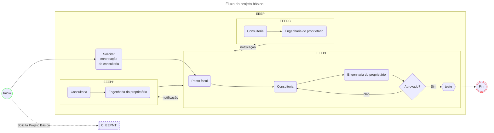
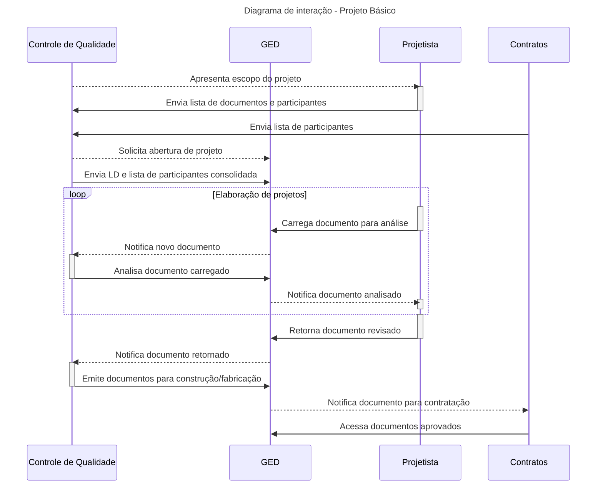
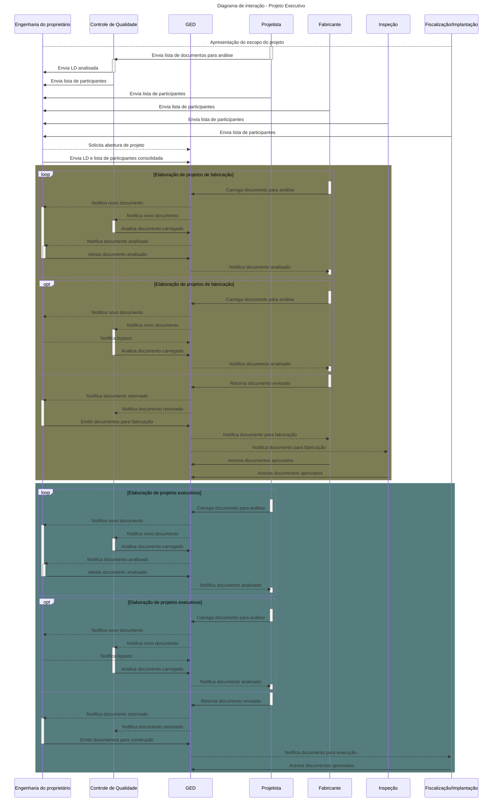
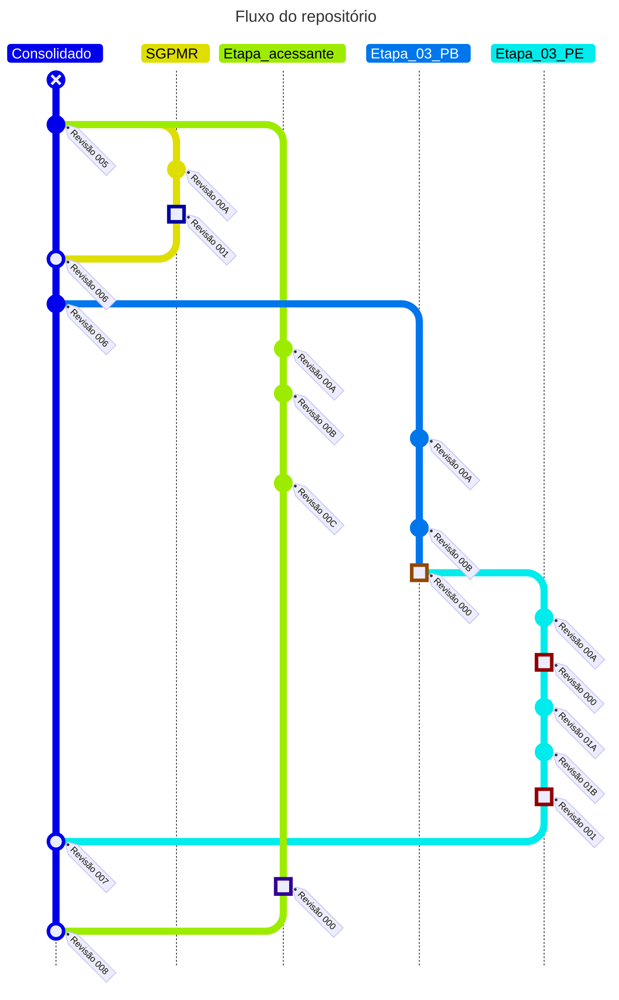

``` mermaid
---
title: Fluxo do projeto básico
---
flowchart LR
  INICIO(("Início")):::inicio --> GP0
  subgraph EEEP
    direction TB
    GP0("Solicitar\n contratação\n de consultoria") --> GPE0("Ponto focal")
    subgraph EEEPE
        direction LR
        GPE0 --> 
        GPE1("Consultoria") --> GPE2("Engenharia do proprietário")
        GPE2 --> D1{"Aprovado?"}
        D1 -->|"Sim"| DB{{"teste"}}
        D1 -->|"Não"| GPE1
    end
    subgraph EEEPC
        direction LR
        GPC1("Consultoria") --> GPC2("Engenharia do proprietário")
    end
    EEEPE -->|"notificação"| EEEPC
    EEEPC --> EEEPE
    subgraph EEEPP
        direction LR
        GOS1("Consultoria") --> GPS2("Engenharia do proprietário")
    end
    EEEPE -->|"notificação"| EEEPP
    EEEPP --> EEEPE
  end
  DB --> FIM((("Fim"))):::fim
  INICIO -.->|"Solicita Projeto Básico"| DOCUMENTO[["CI EEPMT"]]
    
  classDef inicio stroke:#0f0
  classDef fim stroke:#f00
  style DOCUMENTO stroke-dasharray: 5 5
```

```mermaid
---
title: Diagrama de interação - Projeto Básico
---
sequenceDiagram
    Participant Controle de Qualidade
    Participant GED
    Participant Projetista
    Participant Contratos
    Controle de Qualidade-->>Projetista: Apresenta escopo do projeto
    Activate Projetista
    Projetista->>Controle de Qualidade: Envia lista de documentos e participantes
    Deactivate Projetista
    Contratos->>Controle de Qualidade: Envia lista de participantes
    Controle de Qualidade-->>GED: Solicita abertura de projeto
    Controle de Qualidade->>GED: Envia LD e lista de participantes consolidada
    Loop Elaboração de projetos
        Activate Projetista
        Projetista->>GED: Carrega documento para análise
        Deactivate Projetista
        GED-->>Controle de Qualidade: Notifica novo documento
        Activate Controle de Qualidade
        Controle de Qualidade->>GED: Analisa documento carregado
        Deactivate Controle de Qualidade
        GED-->>Projetista: Notifica documento analisado
        Activate Projetista
        Deactivate Projetista
    End
    Activate Projetista
    Projetista->>GED: Retorna documento revisado
    Deactivate Projetista
    GED-->>Controle de Qualidade: Notifica documento retornado
    Activate Controle de Qualidade
    Controle de Qualidade->>GED: Emite documentos para construção/fabricação
    Deactivate Controle de Qualidade
    GED-->>Contratos: Notifica documento para contratação
    Contratos->>GED: Acessa documentos aprovados
```    

```mermaid
---
title: Diagrama de interação - Projeto Executivo
---
sequenceDiagram
    Participant Engenharia do proprietário
    Participant Controle de Qualidade
    Participant GED
    Participant Projetista
    Participant Fabricante
    Participant Inspeção
    Participant Fiscalização/Implantação
    Engenharia do proprietário-->Fiscalização/Implantação: Apresentação do escopo do projeto
    Activate Projetista
    Projetista->>Controle de Qualidade: Envia lista de documentos para análise
    Deactivate Projetista
    Activate Controle de Qualidade
    Controle de Qualidade->>Engenharia do proprietário: Envia LD analisada
    Deactivate Controle de Qualidade
    Controle de Qualidade->>Engenharia do proprietário: Envia lista de participantes
    Projetista->>Engenharia do proprietário: Envia lista de participantes
    Fabricante->>Engenharia do proprietário: Envia lista de participantes
    Inspeção->>Engenharia do proprietário: Envia lista de participantes
    Fiscalização/Implantação->>Engenharia do proprietário: Envia lista de participantes
    Engenharia do proprietário-->>GED: Solicita abertura de projeto
    Engenharia do proprietário->>GED: Envia LD e lista de participantes consolidada
    rect rgb(125, 125, 85)
    Loop Elaboração de projetos de fabricação
        Activate Fabricante
        Fabricante->>GED: Carrega documento para análise
        Deactivate Fabricante
        GED-->>Engenharia do proprietário: Notifica novo documento
        Activate Engenharia do proprietário
        GED-->>Controle de Qualidade: Notifica novo documento
        Activate Controle de Qualidade
        Controle de Qualidade->>GED: Analisa documento carregado
        Deactivate Controle de Qualidade
        GED-->>Engenharia do proprietário: Notifica documento analisado
        Activate Engenharia do proprietário
        Engenharia do proprietário->>GED: Atesta documento analisado
        Deactivate Engenharia do proprietário
        Deactivate Engenharia do proprietário
        GED-->>Fabricante: Notifica documento analisado
        Activate Fabricante
        Deactivate Fabricante
    End
    Opt Elaboração de projetos de fabricação
        Activate Fabricante
        Fabricante->>GED: Carrega documento para análise
        Deactivate Fabricante
        GED-->>Engenharia do proprietário: Notifica novo documento
        GED-->>Controle de Qualidade: Notifica novo documento
        Activate Controle de Qualidade
        Engenharia do proprietário-->>GED: Notifica bypass
        Controle de Qualidade->>GED: Analisa documento carregado
        Deactivate Controle de Qualidade
        GED-->>Fabricante: Notifica documento analisado
        Activate Fabricante
        Deactivate Fabricante
    End
    Activate Fabricante
    Fabricante->>GED: Retorna documento revisado
    Deactivate Fabricante
    GED-->>Engenharia do proprietário: Notifica documento retornado
    Activate Engenharia do proprietário
    GED-->>Controle de Qualidade: Notifica documento retornado
    Engenharia do proprietário->>GED: Emite documentos para fabricação
    Deactivate Engenharia do proprietário
    GED-->>Fabricante: Notifica documento para fabricação
    GED-->>Inspeção: Notifica documento para fabricação
    Fabricante->>GED: Acessa documentos aprovados
    Inspeção->>GED: Acessa documentos aprovados
    End
    rect rgb(85, 125, 125)
    Loop Elaboração de projetos executivos
        Activate Projetista
        Projetista->>GED: Carrega documento para análise
        Deactivate Projetista
        GED-->>Engenharia do proprietário: Notifica novo documento
        Activate Engenharia do proprietário
        GED-->>Controle de Qualidade: Notifica novo documento
        Activate Controle de Qualidade
        Controle de Qualidade->>GED: Analisa documento carregado
        Deactivate Controle de Qualidade
        GED-->>Engenharia do proprietário: Notifica documento analisado
        Activate Engenharia do proprietário
        Engenharia do proprietário->>GED: Atesta documento analisado
        Deactivate Engenharia do proprietário
        Deactivate Engenharia do proprietário
        GED-->>Projetista: Notifica documento analisado
        Activate Projetista
        Deactivate Projetista
    End
    Opt Elaboração de projetos executivos
        Activate Projetista
        Projetista->>GED: Carrega documento para análise
        Deactivate Projetista
        GED-->>Engenharia do proprietário: Notifica novo documento
        GED-->>Controle de Qualidade: Notifica novo documento
        Activate Controle de Qualidade
        Engenharia do proprietário-->>GED: Notifica bypass
        Controle de Qualidade->>GED: Analisa documento carregado
        Deactivate Controle de Qualidade
        GED-->>Projetista: Notifica documento analisado
        Activate Projetista
        Deactivate Projetista
    End
    Activate Projetista
    Projetista->>GED: Retorna documento revisado
    Deactivate Projetista
    GED-->>Engenharia do proprietário: Notifica documento retornado
    Activate Engenharia do proprietário
    GED-->>Controle de Qualidade: Notifica documento retornado
    Engenharia do proprietário->>GED: Emite documentos para construção
    Deactivate Engenharia do proprietário
    GED-->>Fiscalização/Implantação: Notifica documento para execução
    Fiscalização/Implantação->>GED: Acessa documentos aprovados
    End
```

``` mermaid
---
title: Fluxo do repositório
---
%%{init: { 'gitGraph': {'showBranches': true, 'showCommitLabel':false,'mainBranchName': 'Consolidado'}} }%%
      gitGraph TB:
        commit type:REVERSE
        commit tag:"Revisão 005"
        branch SGPMR
        commit tag:"Revisão 00A"
        commit type:HIGHLIGHT tag:"Revisão 001"
        checkout Consolidado
        branch Etapa_acessante
        checkout Consolidado
        merge SGPMR tag:"Revisão 006"
        commit tag:"Revisão 006"
        checkout Etapa_acessante
        commit tag:"Revisão 00A"
        commit tag:"Revisão 00B"
        checkout Consolidado
        branch Etapa_03_PB
        commit tag:"Revisão 00A"
        checkout Etapa_acessante
        commit tag:"Revisão 00C"
        checkout Etapa_03_PB
        commit tag:"Revisão 00B"
        commit type:HIGHLIGHT tag:"Revisão 000"
        branch Etapa_03_PE
        commit tag:"Revisão 00A"
        commit type:HIGHLIGHT tag:"Revisão 000"
        commit tag:"Revisão 01A"
        commit tag:"Revisão 01B"
        commit type:HIGHLIGHT tag:"Revisão 001"
        checkout Consolidado
        merge Etapa_03_PE tag:"Revisão 007"
        checkout Etapa_acessante
        commit type:HIGHLIGHT tag:"Revisão 000"
        checkout Consolidado
        merge Etapa_acessante tag:"Revisão 008"
```