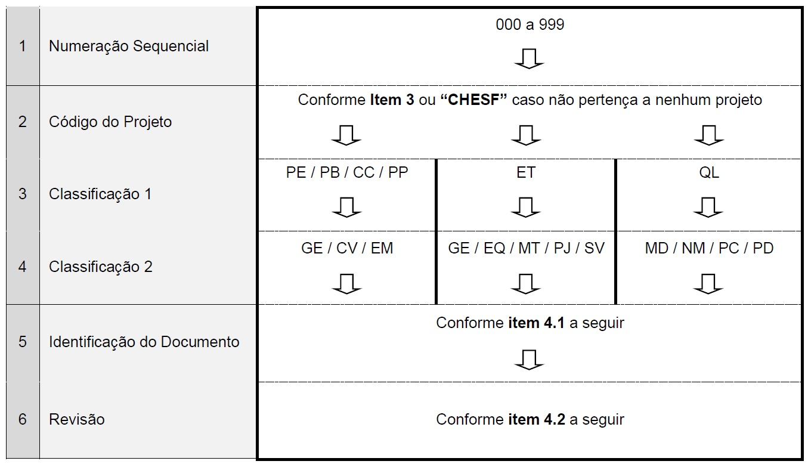

Chesf - TRANSMISSÃO - 102-CHESF-QL-II-ND-R0

# GESTÃO DE DOCUMENTOS - INSTRUÇÃO INTERNA - NOMENCLATURA DE DOCUMENTOS

## OBJETIVO

Esta norma interna tem como objetivo estabelecer critérios para nomenclatura de documentos do Departamento de Engenharia de Subestações – DETS, sejam estes de cunho técnico ou administrativo.

## CONCEITOS

**Documentos de Projeto** – São documentos pertencentes a projetos de subestações. Podem estar relacionados a projetos padrões do departamento ou relacionados a eventos específicos de implantação/ampliação de subestações.

**Especificações Técnicas** – São documentos que definem os requisitos para fornecimento ou execução de serviços como projeto, equipamentos, materiais, construção e comissionamento.

**Documentos da Qualidade** – São documentos que definem as normas de qualidade internas do departamento.

**Evento de Subestação** – Qualquer alteração na subestação que demande a elaboração de projetos.

## CÓDIGO DE PROJETO

O código de projeto será utilizado para identificar o “evento” de implantação ou ampliação da subestação ao qual os documentos fazem parte.

Para cada <u><b>evento de implantação/ampliação</b></u> de subestações deve ser definido um código, que deve conter 5 caracteres da seguinte forma:

<p align="center">
<u><em>XXXYY</em></u>
</p>

*XXX*: Sigla da subestação;<br>
*YY*: Numeração sequencial de 00 a 99, a ser incrementada a cada novo evento criado.

Exemplo: <u><b>IGT01</b></u> *[3° Banco de Autotransformadores da SE Igaporã III]*

Em se tratando de <u><b>projetos padrões</b></u>, que não estão diretamente ligados a uma subestação específica, também devem ser utilizados 5 caracteres, porém com a seguinte formação:

<p align="center">
<b>PP</b><u><em>YYY</em></u>
</p>

*YYY*: Numeração sequencial de 000 a 999, a ser incrementada a cada novo projeto padrão criado.

Exemplo: <u><b>PP001</b></u> 

## PROJETO, ESPECIFICAÇÕES TÉCNICAS E INSTRUÇÕES INTERNAS

A nomenclatura de documentos de projeto, especificações técnicas e documentação interna da qualidade é formada por 6 campos, distribuídos da seguinte forma:

```
         ___ - ___ - ___ - ___ - ___ - ___
Campo n°: 1     2     3     4     5     6
```

Onde:



Exemplos:

<u>101-IGT01-PE-CV-P4-R0</u> – Setor 230 kV - Planta de Bases e Canaletas (Projeto Executivo);

<u>004-ITB00-CC-EM-C2-R1</u> – Setor 69 kV – Cortes (Conforme Construído);

<u>003-CHESF-ET-EQ-DJ-JUN2015</u> – Especificação Técnica – Disjuntores a SF6 (Padrão);

<u>033-PP001-PP-EM-LM-R0</u> – Eletrodutos e Acessórios – Lista de Materiais (Projeto Padrão)

### Campo de Identificação do Documento

O campo de identificação do documento possui dois dígitos e a criação do mnemônico deve ser realizada pelo responsável pela elaboração documento. O criador do documento tem a liberdade para criar novos mnemônicos, que devem possibilitar a identificação do conteúdo do documento. Alguns exemplos já utilizados são indicados na tabela a seguir:

```
AT CB CE CI CP DJ GG MH PR RA RE RL SB SC
HH TA TC TP TR CO EC EF FE IC ID IP DG BU
OL LD DU LE ES MD PS Pn Cn PC LM MC RT OC
II DE TX
```

<p align="center">
<em>n</em>: <u>5 = 500 kV</u> | <u>4 = 230 kV</u> | <u>3 = 138 kV</u> | <u>2 = 69 kV</u> | <u>9 = 34,5 kV</u> | <u>1 = 13,8 kV</u><br>
(Conforme padrão da DO)
</p>

Observar a descrição das siglas no item 5.

### Campo de Revisão

Como regra geral, utilizar <u>R<em>n</em></u>, onde <em>n</em> é uma numeração sequencial de 0 a 9.

Ex: R8

## SIGLAS UTILIZADAS

| Sigla | Descrição                              |
| :---: | :------------------------------------- |
|  AT   | Autotransformadores de Potência        |
|  BU   | Buchas Condensivas                     |
|  CB   | Cubículos Blindados                    |
|  CC   | Conforme Construído                    |
|  CE   | Compensadores Estáticos                |
|  CI   | Cabos Isolados de Alta Tensão          |
|  Cn   | Corte Setor n                          |
|  CO   | Conectores                             |
|  CP   | Capacitores                            |
|  CS   | Construção e Comissionamento           |
|  CV   | Civil                                  |
|  DE   | Desenho                                |
|  DG   | Diretrizes Gerais                      |
|  DJ   | Disjuntor                              |
|  DU   | Diagrama Unifilar                      |
|  EC   | Estruturas de Concreto                 |
|  EF   | Estruturas Metálicas                   |
|  EM   | Eletromecânico                         |
|  EQ   | Equipamentos                           |
|  ES   | Estudo                                 |
|  ET   | Especificação Técnica                  |
|  EV   | Evento                                 |
|  FE   | Ferragens Eletrotécnicas               |
|  GD   | Gestão de Documentos                   |
|  GG   | Grupos Motor-Gerador                   |
|  GE   | Geral                                  |
|  HH   | Previsão de Hxh                        |
|  IC   | Isoladores Compostos                   |
|  ID   | Isoladores de Disco                    |
|  II   | Instrução Interna                      |
|  IN   | Indicadores                            |
|  IP   | Isoladores Suporte de Porcelana        |
|  LD   | Lista de Documentos                    |
|  LE   | Lista de Equipamentos                  |
|  LM   | Lista de Materiais                     |
|  MC   | Memória de Cálculo                     |
|  MD   | Memorial Descritivo                    |
|  ME   | Mapeamento Estratégico                 |
|  MH   | Módulo Híbrido                         |
|  MT   | Materiais                              |
|  OC   | Orçamento                              |
|  OL   | Óleo Mineral Isolante                  |
|  PB   | Projeto Básico                         |
|  PC   | Planta e Corte                         |
|  PE   | Projeto Executivo                      |
|  PI   | Processos Internos                     |
|  PJ   | Projeto                                |
|  Pn   | Planta Setor n                         |
|  PP   | Projeto Padrão                         |
|  PR   | Para-raios                             |
|  PS   | Planta de Situação e Localização       |
|  QL   | Qualidade                              |
|  RA   | Reatores de Aterramento                |
|  RE   | Reatores de Derivação                  |
|  RL   | Reatores Limitadores                   |
|  RT   | Relatório Técnico                      |
|  SB   | Subestações Blindadas (GIS)            |
|  SC   | Secionadores e Chaves de Aterramento   |
|  TA   | Transformadores de Serviços Auxiliares |
|  TC   | Transformadores de Corrente            |
|  TP   | Transformadores de Potencial           |
|  TR   | Transformadores de Potência            |
|  TX   | Texto                                  |
