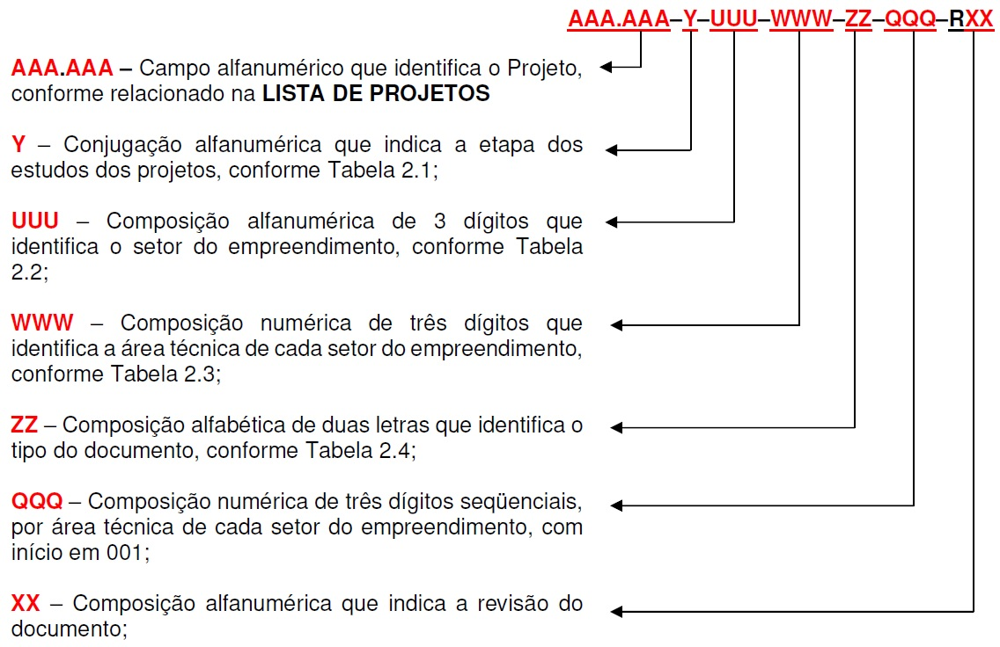
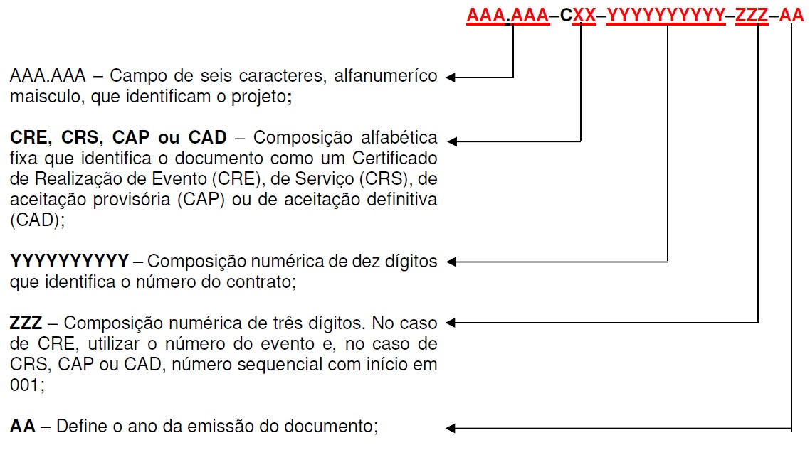
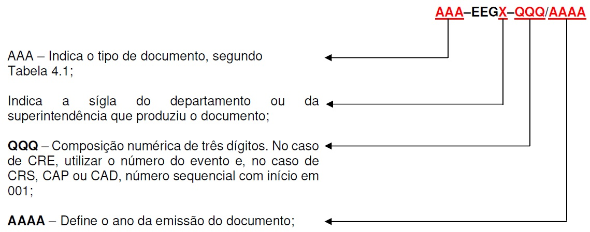

Eletronorte - GERAÇÃO - IT-EEG-GER-001-R4 - Codificação de documentos

# Codificação de Documentos na EEG

INSTRUÇÃO DE TRABALHO

IT-EEG-GER-001-R4

Estabelece regras de codificação de documentos da Superintendência de Engenharia de Geração

## INTRODUÇÃO

Esta instrução de trabalho (IT) define os parâmetros de codificação de documentos produzidos pela EEG. As regras definidas são também aplicáveis a todos os documentos produzidos pelas empresas contratadas para realizar levantamentos, estudos e projetos para a EEG, mesmo que também incluam no documento sua própria numeração.

Essa IT não se aplica aos documentos com regra de numeração já consolidada nos processos do Departamento de Inspeção e Controle de Qualidade de Fornecimento – EEGI e aos documentos já emitidos em acordo com versões anteriores à IT, que não precisam ter sua numeração revisada.

Guardadas as ressalvas do parágrafo anterior, essa IT é de uso obrigatório nos departamentos da EEG.

## CODIFICAÇÃO DE DOCUMENTOS DE PROJETOS

### CÓDIGO DE PROJETOS

Os Projetos deverão ser registrados na LISTA DE PROJETOS, Anexo 1, com a definição das seguintes informações:

#### CÓDIGO IDENTIFICADOR DO PROJETO

O código identificador do projeto será um campo de seis caracteres separados por um ponto (XXX.XXX), alfanumérico maiúsculo, sendo que os três primeiros caracteres identificam o Empreendimento, enquanto os três dígitos subsequentes identificam o projeto vinculado ao empreendimento. Quando o empreendimento for o próprio projeto, usa-se “000” no segundo trecho; quando não houver empreendimento vinculado ao projeto, usa-se “000” no primeiro trecho.

#### NOME DO PROJETO

Campo que estabelece o nome do projeto.

#### SITUAÇÃO

Indicar a situação do projeto, ou seja, se está paralisado, concluído, a iniciar, em andamento ou se se trata de uma prestação de serviço para outra área, situação em que deverá ser preenchida a coluna de descrição da prestação de serviço.

#### ÁREAS ENVOLVIDAS

Indicar quais departamentos da EEG estão envolvidos nos serviços de cada projeto.

### CODIFICAÇÃO DE DOCUMENTOS TÉCNICOS

Os documentos técnicos, planejamento e gestão de projeto serão codificados conforme definição a seguir:

O último item, o relativo à revisão, classificará o documento a ser aprovado, inicialmente, como R0A. Diante das revisões, esse campo assumirá valores R0B, R0C e assim por diante até o documento ser aprovado, quando o campo deverá assumir o valor R0. Após aprovação, sendo necessária nova revisão, o documento deverá ser classificado como R1A e o processo de aprovação deverá ser repetido e, após aprovação, o documento assumirá classificação R1.

**Tabela 2.1** – Etapa do Empreendimento (Campo Y)

| CÓDIGO | DESCRIÇÃO              |
| :----: | :--------------------- |
|   P    | PLANEJAMENTO           |
|   A    | ANTE PROJETO           |
|   I    | INVENTÁRIO             |
|   V    | ESTUDOS DE VIABILIDADE |
|   B    | PROJETO BÁSICO         |
|   L    | LEILÃO                 |
|   T    | LICITAÇÃO              |
|   E    | PROJETO EXECUTIVO      |
|   F    | IMPLANTAÇÃO            |
|   S    | COMO CONSTRUIDO        |
|   O    | OPERAÇÃO E MANUTENÇÃO  |
|   D    | DESATIVAÇÃO            |

**Tabela 2.2** – Setor do Empreendimento (Campo UUU)

| CÓDIGO | DESCRIÇÃO                                                       |
| :----: | :-------------------------------------------------------------- |
|  GER   | GERAL                                                           |
|  ALM   | ALMOXARIFADO                                                    |
|  BAR   | BARRAGEM (GERAL)                                                |
|  CAF   | CASA DE FORÇA                                                   |
|  CDA   | CASTELO D’ÁGUA                                                  |
|  CFU   | CANAL DE FUGA                                                   |
|  CMQ   | CASA DE MÁQUINAS                                                |
|  COM   | MUROS DE CONTENÇÃO                                              |
|  CSA   | CASA DOS SERVIÇOS AUXILIARES                                    |
|  CTA   | SETOR DE CAPTAÇÃO, ARMAZENAMENTO E TRATAMENTO DE ÁGUA           |
|  DIK   | DIQUES                                                          |
|  DPG   | DEPÓSITO DE GASES                                               |
|  DPQ   | DEPÓSITO DE PRODUTOS QUÍMICOS                                   |
|  ECL   | ECLUSA                                                          |
|  ECO   | EDIFÍCIO DE CONTROLE                                            |
|  EFE   | ESTRADAS DE FERRO                                               |
|  ENS   | ENSECADEIRAS                                                    |
|  ERR   | ESTRADAS DE RODAGEM                                             |
|  GUA   | GUARITA                                                         |
|  LAB   | LABORATORIO                                                     |
|  LIN   | LINHAS DE TRANSMISSÃO                                           |
|  MPO   | MUROS DE PROTEÇÃO DE OBRAS HIDRÁULICAS                          |
|  MTA   | MUROS DE TRANSIÇÃO OU ALA                                       |
|  ODR   | OBRAS DE DESVIO DO RIO                                          |
|  OFI   | OFICINAS                                                        |
|  PAD   | PRÉDIO ADMINISTRATIVO                                           |
|  PFU   | PORTO FLUVIAL                                                   |
|  POV   | PONTES E VIADUTOS                                               |
|  RCO   | SETOR DE RECEBIMENTO, ARMAZENAMENTO E TRATAMENTO DE COMBUSTÍVEL |
|  REF   | REFEITÓRIOS                                                     |
|  RES   | RESERVATÓRIO                                                    |
|  RMD   | REDE MÉDIA                                                      |
|  RPR   | RIO PRINCIPAL                                                   |
|  SAP   | SÍTIO DO APROVEITAMENTO                                         |
|  STP   | SISTEMA DE TRANSPOSIÇÃO DE PEIXES                               |
|  SUB   | SUBESTAÇÃO                                                      |
|  TAD   | TÚNEIS DE ADUÇÃO                                                |
|  TAG   | TOMADA D'ÁGUA                                                   |
|  TCI   | TOMADA D'ÁGUA/CASA DE FORÇA INTEGRADAS                          |
|  TDR   | TÚNEL DE DRENAGEM                                               |
|  VRE   | VILAS RESIDENCIAIS                                              |
|  VTC   | VERTEDOURO COMPLEMENTAR                                         |
|  VTD   | VERTEDOURO                                                      |
|  VTP   | VERTEDOURO PRINCIPAL                                            |

**Tabela 2.3** – Setores de Projeto (Campo WWW)

|                           SETOR                           | CÓDIGO | DESCRIÇÃO                                                                                                                                                                                                    |
| :-------------------------------------------------------: | :----: | :----------------------------------------------------------------------------------------------------------------------------------------------------------------------------------------------------------- |
|                           GERAL                           |  000   | GERAL                                                                                                                                                                                                        |
|                           CIVIL                           |  100   | GERAL                                                                                                                                                                                                        |
|                           CIVIL                           |  101   | ESTRUTURAS – FORMAS                                                                                                                                                                                          |
|                           CIVIL                           |  102   | ESTRUTURAS – ARMADURA                                                                                                                                                                                        |
|                           CIVIL                           |  103   | EMBUTIDOS – 1º ESTÁGIO                                                                                                                                                                                       |
|                           CIVIL                           |  104   | EMBUTIDOS – 2º ESTÁGIO                                                                                                                                                                                       |
|                           CIVIL                           |  105   | TECNOLOGIA DE MATERIAIS                                                                                                                                                                                      |
|                           CIVIL                           |  106   | SANEAMENTO                                                                                                                                                                                                   |
|                           CIVIL                           |  107   | INSTALAÇÕES HIDROS-SANITÁRIAS                                                                                                                                                                                |
|                           CIVIL                           |  108   | HIDROLOGIA / HIDROMETRIA                                                                                                                                                                                     |
|                           CIVIL                           |  109   | HIDRÁULICA                                                                                                                                                                                                   |
|                           CIVIL                           |  110   | INSTRUMENTAÇÃO                                                                                                                                                                                               |
|                           CIVIL                           |  111   | SISTEMA VIÁRIO                                                                                                                                                                                               |
|                           CIVIL                           |  112   | GEOTECNIA                                                                                                                                                                                                    |
|                           CIVIL                           |  113   | MODELOS HIDRÁULICOS REDUZIDOS                                                                                                                                                                                |
|                           CIVIL                           |  114   | CARTOGRAFIA                                                                                                                                                                                                  |
|                           CIVIL                           |  115   | ARMÁRIOS PARA MANGUEIRAS E DEMAIS EQUIPAMENTOS DO SISTEMA DE COMBATE A INCÊNDIO                                                                                                                              |
|                           CIVIL                           |  116   | BACIAS DE CONTENÇÃO/ BACIAS DE TANQUES                                                                                                                                                                       |
|                           CIVIL                           |  117   | BASES PARA SUPORTE DE BANDEJAS PARA CABOS E POSTES                                                                                                                                                           |
|                           CIVIL                           |  118   | CANALETAS, CAIXAS E GALERIAS                                                                                                                                                                                 |
|                           CIVIL                           |  119   | CANALETAS, ENVELOPES E CAIXAS DE PASSAGEM PARA CABOS ELÉTRICOS                                                                                                                                               |
|                           CIVIL                           |  120   | CANTEIRO DE OBRAS                                                                                                                                                                                            |
|                           CIVIL                           |  121   | DEMOLIÇÕES                                                                                                                                                                                                   |
|                           CIVIL                           |  122   | DORMENTES BASES PARA SUPORTE DE TUBULAÇÕES                                                                                                                                                                   |
|                           CIVIL                           |  123   | DRENAGEM DE EFLUENTES OLEOSOS                                                                                                                                                                                |
|                           CIVIL                           |  124   | DRENAGEM PLUVIAL                                                                                                                                                                                             |
|                           CIVIL                           |  125   | ENTERRADOS                                                                                                                                                                                                   |
|                           CIVIL                           |  126   | ESTAQUEAMENTO                                                                                                                                                                                                |
|                           CIVIL                           |  127   | ESTRUTURAS METÁLICAS, ESCADAS E PASSARELAS METÁLICAS                                                                                                                                                         |
|                           CIVIL                           |  128   | FUNDAÇÕES E BASES DE EQUIPAMENTOS                                                                                                                                                                            |
|                           CIVIL                           |  129   | MUROS, CERCAS, ALAMBRADOS E PORTÕES                                                                                                                                                                          |
|                           CIVIL                           |  130   | PEÇAS METÁLICAS, CHUMBADORES E EMBUTIDOS                                                                                                                                                                     |
|                           CIVIL                           |  131   | TERRAPLENAGEM                                                                                                                                                                                                |
|                           CIVIL                           |  190   | GEOLOGIA / GEOLOGIA DE ENGENHARIA                                                                                                                                                                            |
|                         MECÂNICO                          |  200   | GERAL                                                                                                                                                                                                        |
|                         MECÂNICO                          |  201   | TURBINAS E PERIFÉRICOS                                                                                                                                                                                       |
|                         MECÂNICO                          |  202   | SISTEMAS AUXILIARES (DRENAGEM, ESGOTAMENTO, ÁGUA POTÁVEL, ÁGUA DE SERVIÇO, ÁGUA DE RESFRIAMENTO, ÁGUA DE COMBATE A INCÊNDIO, ESGOTAMENTO, ESGOTO SANITÁRIO, AR COMPRIMIDO, ÓLEO ISOLANTE, ÓLEO LUBRIFICANTE, |
|                         MECÂNICO                          |  203   | EQUIPAMENTOS DE LEVANTAMENTO – PONTE ROLANTE - PÓRTICOS                                                                                                                                                      |
|                         MECÂNICO                          |  205   | INSTRUMENTAÇÃO                                                                                                                                                                                               |
|                         MECÂNICO                          |  207   | SISTEMAS AUXILIARES – TUBULAÇÕES EMBUTIDAS                                                                                                                                                                   |
|                         MECÂNICO                          |  208   | TURBINA E PERIFÉRICOS – ACABAMENTO                                                                                                                                                                           |
|                         MECÂNICO                          |  209   | SISTEMAS AUXILIARES – TUBULAÇÕES APARENTES                                                                                                                                                                   |
|                         MECÂNICO                          |  210   | SISTEMAS HIDROMECÂNICOS – ACABAMENTO                                                                                                                                                                         |
|                         MECÂNICO                          |  211   | SISTEMAS AUXILIARES – VENTILAÇÃO, EXAUSTÃO E AR CONDICIONADO                                                                                                                                                 |
|                         MECÂNICO                          |  212   | HIDROMECÂNICOS - COMPORTAS                                                                                                                                                                                   |
|                         MECÂNICO                          |  213   | ESTRUTURAS E ACABAMENTOS METÁLICOS                                                                                                                                                                           |
|                         MECÂNICO                          |  214   | PÓRTICO ROLANTE                                                                                                                                                                                              |
|                         MECÂNICO                          |  215   | CONDUTO FORÇADO                                                                                                                                                                                              |
|                         MECÂNICO                          |  216   | GRADES                                                                                                                                                                                                       |
|                         MECÂNICO                          |  217   | ELEVADOR                                                                                                                                                                                                     |
|        SERVIÇOS AUXILIARES E INSTALAÇÕES ELÉTRICAS        |  300   | GERAL                                                                                                                                                                                                        |
|        SERVIÇOS AUXILIARES E INSTALAÇÕES ELÉTRICAS        |  301   | ARRANJO DE EQUIPAMENTOS                                                                                                                                                                                      |
|        SERVIÇOS AUXILIARES E INSTALAÇÕES ELÉTRICAS        |  302   | INSTALAÇÃO DE PAINÉIS E CHUMBADORES                                                                                                                                                                          |
|        SERVIÇOS AUXILIARES E INSTALAÇÕES ELÉTRICAS        |  311   | SISTEMA DE ATERRAMENTO                                                                                                                                                                                       |
|        SERVIÇOS AUXILIARES E INSTALAÇÕES ELÉTRICAS        |  312   | ATERRAMENTO EMBUTIDO                                                                                                                                                                                         |
|        SERVIÇOS AUXILIARES E INSTALAÇÕES ELÉTRICAS        |  313   | ATERRAMENTO EXPOSTO                                                                                                                                                                                          |
|        SERVIÇOS AUXILIARES E INSTALAÇÕES ELÉTRICAS        |  321   | SISTEMA DE ILUMINAÇÃO                                                                                                                                                                                        |
|        SERVIÇOS AUXILIARES E INSTALAÇÕES ELÉTRICAS        |  322   | INSTALAÇÃO DE LUZ - ILUMINAÇÃO                                                                                                                                                                               |
|        SERVIÇOS AUXILIARES E INSTALAÇÕES ELÉTRICAS        |  331   | SISTEMA DE CONDUTOS PARA CABOS                                                                                                                                                                               |
|        SERVIÇOS AUXILIARES E INSTALAÇÕES ELÉTRICAS        |  332   | ELETRODUTOS EMBUTIDOS                                                                                                                                                                                        |
|        SERVIÇOS AUXILIARES E INSTALAÇÕES ELÉTRICAS        |  333   | ELETRODUTOS EXPOSTOS, EMBUTIDOS NO ACABAMENTO E CANALETAS PARA CABOS                                                                                                                                         |
|        SERVIÇOS AUXILIARES E INSTALAÇÕES ELÉTRICAS        |  334   | LEITOS PARA CABOS                                                                                                                                                                                            |
|        SERVIÇOS AUXILIARES E INSTALAÇÕES ELÉTRICAS        |  340   | PONTES ROLANTES E PÓRTICOS (SERVIÇOS AUXILIARES ELÉTRICOS)                                                                                                                                                   |
|        SERVIÇOS AUXILIARES E INSTALAÇÕES ELÉTRICAS        |  350   | SERVIÇOS AUXILIARES DE C. A. (DIAGR., MEMÓRIAS DE CÁLCULO, ESPECIFICAÇÕES ETC.)                                                                                                                              |
|        SERVIÇOS AUXILIARES E INSTALAÇÕES ELÉTRICAS        |  351   | TRANSFORMADORES DE SERVIÇOS AUXILIARES                                                                                                                                                                       |
|        SERVIÇOS AUXILIARES E INSTALAÇÕES ELÉTRICAS        |  352   | GERADORES DIESEL                                                                                                                                                                                             |
|        SERVIÇOS AUXILIARES E INSTALAÇÕES ELÉTRICAS        |  353   | CUBICULO DE MÉDIA TENSÃO                                                                                                                                                                                     |
|        SERVIÇOS AUXILIARES E INSTALAÇÕES ELÉTRICAS        |  354   | QUADROS DE BAIXA TENSÃO                                                                                                                                                                                      |
|        SERVIÇOS AUXILIARES E INSTALAÇÕES ELÉTRICAS        |  355   | REATORES                                                                                                                                                                                                     |
|        SERVIÇOS AUXILIARES E INSTALAÇÕES ELÉTRICAS        |  380   | SERVIÇOS AUXILIARES DE C. C. (DIAGR., MEMÓRIAS DE CÁLCULO, ESPECIFICAÇÕES ETC.)                                                                                                                              |
|        SERVIÇOS AUXILIARES E INSTALAÇÕES ELÉTRICAS        |  381   | BATERIAS E CARREGADORES                                                                                                                                                                                      |
|        SERVIÇOS AUXILIARES E INSTALAÇÕES ELÉTRICAS        |  382   | CONVERSOS ESTÁTICO CC/CA                                                                                                                                                                                     |
|        SERVIÇOS AUXILIARES E INSTALAÇÕES ELÉTRICAS        |  383   | QUADROS DE C. C.                                                                                                                                                                                             |
|        SERVIÇOS AUXILIARES E INSTALAÇÕES ELÉTRICAS        |  390   | GERADORES AUXILIARES                                                                                                                                                                                         |
|        SERVIÇOS AUXILIARES E INSTALAÇÕES ELÉTRICAS        |  391   | REGULADOR DE TENSÃO DO GERADOR AUXILIAR                                                                                                                                                                      |
|        SERVIÇOS AUXILIARES E INSTALAÇÕES ELÉTRICAS        |  392   | REGULADOR ELETRÔNICO DE VELOCIDADE DO GERADOR AUXILIAR                                                                                                                                                       |
| SUPERVISÃO, PROTEÇÃO, CONTROLE DIGITAL E TELECOMUNICAÇÕES |  400   | GERAL                                                                                                                                                                                                        |
| SUPERVISÃO, PROTEÇÃO, CONTROLE DIGITAL E TELECOMUNICAÇÕES |  410   | SISTEMA DE SUPERVISÃO                                                                                                                                                                                        |
| SUPERVISÃO, PROTEÇÃO, CONTROLE DIGITAL E TELECOMUNICAÇÕES |  430   | SISTEMA DE CONTROLE                                                                                                                                                                                          |
| SUPERVISÃO, PROTEÇÃO, CONTROLE DIGITAL E TELECOMUNICAÇÕES |  450   | SISTEMA DE PROTEÇÃO                                                                                                                                                                                          |
| SUPERVISÃO, PROTEÇÃO, CONTROLE DIGITAL E TELECOMUNICAÇÕES |  480   | SISTEMA DE TELECOMUNICAÇÕES                                                                                                                                                                                  |
| SUPERVISÃO, PROTEÇÃO, CONTROLE DIGITAL E TELECOMUNICAÇÕES |  481   | SISTEMA DE TELEFONIA E BUSCA PESSOA                                                                                                                                                                          |
| SUPERVISÃO, PROTEÇÃO, CONTROLE DIGITAL E TELECOMUNICAÇÕES |  482   | SISTEMA CFTV                                                                                                                                                                                                 |
| SUPERVISÃO, PROTEÇÃO, CONTROLE DIGITAL E TELECOMUNICAÇÕES |  483   | SISTEMA DE BUSCA PESSOA                                                                                                                                                                                      |
| SUPERVISÃO, PROTEÇÃO, CONTROLE DIGITAL E TELECOMUNICAÇÕES |  484   | SISTEMA DE CARRIER                                                                                                                                                                                           |
| SUPERVISÃO, PROTEÇÃO, CONTROLE DIGITAL E TELECOMUNICAÇÕES |  485   | COMUNICAÇÃO ÓPTICA                                                                                                                                                                                           |
| SUPERVISÃO, PROTEÇÃO, CONTROLE DIGITAL E TELECOMUNICAÇÕES |  486   | SISTEMA DE DADOS                                                                                                                                                                                             |
| SUPERVISÃO, PROTEÇÃO, CONTROLE DIGITAL E TELECOMUNICAÇÕES |  487   | SISTEMA DE RÁDIO                                                                                                                                                                                             |
| SUPERVISÃO, PROTEÇÃO, CONTROLE DIGITAL E TELECOMUNICAÇÕES |  488   | SISTEMA DE TELEPROTEÇÃO                                                                                                                                                                                      |
|             EQUIPAMENTOS ELÉTRICOS PRINCIPAIS             |  500   | GERAL                                                                                                                                                                                                        |
|             EQUIPAMENTOS ELÉTRICOS PRINCIPAIS             |  510   | GERADORES                                                                                                                                                                                                    |
|             EQUIPAMENTOS ELÉTRICOS PRINCIPAIS             |  511   | ARRANJO FÍSICO E PEÇAS EMBUTIDAS                                                                                                                                                                             |
|             EQUIPAMENTOS ELÉTRICOS PRINCIPAIS             |  512   | LOCAÇÃO DE GERADORES                                                                                                                                                                                         |
|             EQUIPAMENTOS ELÉTRICOS PRINCIPAIS             |  513   | SISTEMA DE EXCITAÇÃO E REGULAÇÃO DE TENSÃO                                                                                                                                                                   |
|             EQUIPAMENTOS ELÉTRICOS PRINCIPAIS             |  514   | SISTEMA DE REFRIGERAÇÃO - RADIADORES                                                                                                                                                                         |
|             EQUIPAMENTOS ELÉTRICOS PRINCIPAIS             |  515   | SISTEMA DE LEVANTAMENTO E FRENAGEM                                                                                                                                                                           |
|             EQUIPAMENTOS ELÉTRICOS PRINCIPAIS             |  530   | TRANSFORMADORES ELEVADORES                                                                                                                                                                                   |
|             EQUIPAMENTOS ELÉTRICOS PRINCIPAIS             |  531   | ARRANJO FÍSICO                                                                                                                                                                                               |
|             EQUIPAMENTOS ELÉTRICOS PRINCIPAIS             |  533   | LOCAÇÃO DE TRANSFORMADORES ELEVADORES                                                                                                                                                                        |
|             EQUIPAMENTOS ELÉTRICOS PRINCIPAIS             |  540   | PÁRA-RAIOS                                                                                                                                                                                                   |
|             EQUIPAMENTOS ELÉTRICOS PRINCIPAIS             |  550   | TPC – TRANSFORMADOR DE POTENCIAL CAPACITIVO                                                                                                                                                                  |
|             EQUIPAMENTOS ELÉTRICOS PRINCIPAIS             |  560   | BARRAMENTOS / CONEXÕES                                                                                                                                                                                       |
|             EQUIPAMENTOS ELÉTRICOS PRINCIPAIS             |  561   | ARRANJO FÍSICO, SUPORTES E PEÇAS EMBUTIDAS                                                                                                                                                                   |
|             EQUIPAMENTOS ELÉTRICOS PRINCIPAIS             |  562   | EQUIPAMENTOS ASSOCIADOS                                                                                                                                                                                      |
|             EQUIPAMENTOS ELÉTRICOS PRINCIPAIS             |  563   | LOCAÇÃO DE EQUIPAMENTOS                                                                                                                                                                                      |
|             EQUIPAMENTOS ELÉTRICOS PRINCIPAIS             |  570   | ESTRUTURA METÁLICA DE LINHA DE TRANSMISSÃO                                                                                                                                                                   |
|            ARQUITETURA, URBANISMO E PAISAGISMO            |  600   | GERAL                                                                                                                                                                                                        |
|            ARQUITETURA, URBANISMO E PAISAGISMO            |  601   | PROJETO ARQUITETÔNICO                                                                                                                                                                                        |
|            ARQUITETURA, URBANISMO E PAISAGISMO            |  602   | PROJETO DE URBANISMO                                                                                                                                                                                         |
|            ARQUITETURA, URBANISMO E PAISAGISMO            |  603   | PROJETO DE CONFORTO AMBIENTAL                                                                                                                                                                                |
|            ARQUITETURA, URBANISMO E PAISAGISMO            |  604   | ACABAMENTOS INTERNOS                                                                                                                                                                                         |
|            ARQUITETURA, URBANISMO E PAISAGISMO            |  605   | ACABAMENTOS EXTERNOS                                                                                                                                                                                         |
|            ARQUITETURA, URBANISMO E PAISAGISMO            |  606   | ILUMINAÇÃO                                                                                                                                                                                                   |
|            ARQUITETURA, URBANISMO E PAISAGISMO            |  607   | PAISAGISMO                                                                                                                                                                                                   |
|            ARQUITETURA, URBANISMO E PAISAGISMO            |  608   | SISTEMA VIÁRIO                                                                                                                                                                                               |
|        PLANEJAMENTO, PROGRAMAÇÃO E ACOMPANHAMENTO         |  700   | GERAL                                                                                                                                                                                                        |
|        PLANEJAMENTO, PROGRAMAÇÃO E ACOMPANHAMENTO         |  701   | PLANEJAMENTO DE PROJETO                                                                                                                                                                                      |
|        PLANEJAMENTO, PROGRAMAÇÃO E ACOMPANHAMENTO         |  702   | PLANEJAMENTO DE EXECUÇÃO DAS OBRAS CIVIS                                                                                                                                                                     |
|        PLANEJAMENTO, PROGRAMAÇÃO E ACOMPANHAMENTO         |  703   | PLANEJAMENTO DE MONTAGEM ELETROMECÂNICA                                                                                                                                                                      |
|        PLANEJAMENTO, PROGRAMAÇÃO E ACOMPANHAMENTO         |  704   | PLANEJAMENTO/ESTUDO ENERGÉTICO                                                                                                                                                                               |
|        PLANEJAMENTO, PROGRAMAÇÃO E ACOMPANHAMENTO         |  705   | PLANEJAMENTO ELÉTRICO                                                                                                                                                                                        |
|        PLANEJAMENTO, PROGRAMAÇÃO E ACOMPANHAMENTO         |  706   | LOGÍSTICA DE ABASTECIMENTO                                                                                                                                                                                   |
|        PLANEJAMENTO, PROGRAMAÇÃO E ACOMPANHAMENTO         |  707   | LOGÍSTICA DE TRANSPORTE                                                                                                                                                                                      |
|        PLANEJAMENTO, PROGRAMAÇÃO E ACOMPANHAMENTO         |  708   | OPERAÇÃO DA USINA                                                                                                                                                                                            |
|        PLANEJAMENTO, PROGRAMAÇÃO E ACOMPANHAMENTO         |  709   | OPERAÇÃO DO SISTEMA DE TRANSMISSÃO                                                                                                                                                                           |
|        PLANEJAMENTO, PROGRAMAÇÃO E ACOMPANHAMENTO         |  710   | ORÇAMENTO                                                                                                                                                                                                    |
|                       MEIO AMBIENTE                       |  800   | GERAL                                                                                                                                                                                                        |
|                       MEIO AMBIENTE                       |  801   | CLIMATOLOGIA, HIDROMETEOROLOGIA E HIDROLOGIA                                                                                                                                                                 |
|                       MEIO AMBIENTE                       |  802   | GEOLOGIA, HIDROGEOLOGIA E RECURSOS MINERAIS                                                                                                                                                                  |
|                       MEIO AMBIENTE                       |  803   | GEOMORFOLOGIA                                                                                                                                                                                                |
|                       MEIO AMBIENTE                       |  804   | SOLOS                                                                                                                                                                                                        |
|                       MEIO AMBIENTE                       |  805   | QUALIDADE DA ÁGUA                                                                                                                                                                                            |
|                       MEIO AMBIENTE                       |  806   | QUALIDADE DO AR E RUÍDOS                                                                                                                                                                                     |
|                       MEIO AMBIENTE                       |  807   | VEGETAÇÃO                                                                                                                                                                                                    |
|                       MEIO AMBIENTE                       |  808   | FAUNA                                                                                                                                                                                                        |
|                       MEIO AMBIENTE                       |  809   | SOCIOLOGIA E ASSISTÊNCIA SOCIAL                                                                                                                                                                              |
|                       MEIO AMBIENTE                       |  810   | ECONOMIA                                                                                                                                                                                                     |
|                       MEIO AMBIENTE                       |  811   | DEMOGRAFIA                                                                                                                                                                                                   |
|                       MEIO AMBIENTE                       |  812   | HABITAÇÃO                                                                                                                                                                                                    |
|                       MEIO AMBIENTE                       |  813   | INFRA-ESTRUTURA URBANA E REGIONAL / SERVIÇOS PÚBLICOS                                                                                                                                                        |
|                       MEIO AMBIENTE                       |  814   | USO E OCUPAÇÃO DO SOLO                                                                                                                                                                                       |
|                       MEIO AMBIENTE                       |  815   | SAÚDE PÚBLICA                                                                                                                                                                                                |
|                       MEIO AMBIENTE                       |  816   | PATRIMÔNIO CULTURAL                                                                                                                                                                                          |
|                       MEIO AMBIENTE                       |  817   | CONSERVAÇÃO E FISCALIZAÇÃO AMBIENTAIS                                                                                                                                                                        |
|                       MEIO AMBIENTE                       |  818   | COMUNICAÇÃO SOCIAL / EDUCAÇÃO AMBIENTAL                                                                                                                                                                      |
|                       MEIO AMBIENTE                       |  819   | RECUPERAÇÃO DE ÁREAS DEGRADADAS                                                                                                                                                                              |
|                           GERAL                           |  900   | INFORMÁTICA                                                                                                                                                                                                  |
|                           GERAL                           |  901   | NORMATIZAÇÃO                                                                                                                                                                                                 |

**Tabela 2.4** – Tipo de documento (campo ZZ)

| CÓDIGO | DESCRIÇÃO                                                                                  |
| :----: | :----------------------------------------------------------------------------------------- |
|   AT   | ATA DE REUNIÃO                                                                             |
|   AD   | AVALIAÇÃO DE DESEMPENHO DO CONTRATADO                                                      |
|   AG   | ARRANJO GERAL E DISPOSIÇÕES BÁSICAS                                                        |
|   CC   | CERTIFICADO DE CONCLUSÃO DE COMISSIONAMENTO - CCC                                          |
|   CD   | CODIFICAÇÃO DE MATERIAIS                                                                   |
|   CG   | CRONOGRAMA                                                                                 |
|   CM   | CERTIFICADO DE CONCLUSÃO DE MONTAGEM – CCM                                                 |
|   CQ   | CROQUI                                                                                     |
|   CR   | CRITÉRIOS DE PROJETO                                                                       |
|   CS   | COMPOSIÇÃO DE PREÇOS                                                                       |
|   CT   | CATÁLOGO                                                                                   |
|   DS   | DECLARAÇÃO DE ESCOPO                                                                       |
|   DO   | DEMONSTRATIVO DO ORÇAMENTO:                                                                |
|   DP   | DECLARAÇÃO DE JUSTIFICATIVA DE PREÇOS                                                      |
|   DR   | DOCUMENTAÇÃO DE REQUISITOS                                                                 |
|   DE   | DESENHO TÉCNICO, DE ESPECIFICAÇÃO, DE ESTUDO                                               |
|   EA   | ESTRUTURA ANALÍTICA DE PROJETO                                                             |
|   EL   | LISTA DE ELETRODUTOS E CANALETAS                                                           |
|   ES   | ESTUDOS                                                                                    |
|   ET   | ESPECIFICAÇÃO TÉCNICA                                                                      |
|   FD   | FOLHA DE DADOS (MECÂNICA, ELÉTRICA, INSTRUMENTAÇÃO, TELECOMUNICAÇÃO, ETC)                  |
|   FM   | FORMULÁRIO PARA SOLICITAÇÃO DE MUDANÇAS:                                                   |
|   IC   | INSTRUÇÃO DE COMISSIONAMENTO                                                               |
|   IE   | LISTA DE IDENTIFICAÇÃO DE EMPREENDIMENTO                                                   |
|   II   | INSTRUÇÃO DE INSTALAÇÃO                                                                    |
|   IM   | INSTRUÇÃO DE MONTAGEM                                                                      |
|   LC   | LISTA DE CABOS E/OU CONECTORES                                                             |
|   LD   | PCDT - PROGRAMAÇÃO E CONTROLE DE DOCUMENTOS TÉCNICOS                                       |
|   LE   | LISTA DE EQUIPAMENTOS                                                                      |
|   LF   | LISTA DE FERROS                                                                            |
|   LI   | LISTA DE INSTRUMENTOS                                                                      |
|   LL   | LISTA DE LINHAS                                                                            |
|   LM   | LISTA DE MATERIAIS DE DESENHOS EXECUTIVOS                                                  |
|   LP   | LISTA DE PONTOS DE ENTRADA                                                                 |
|   LQ   | LISTA DE MATERIAIS DE CROQUI                                                               |
|   LS   | LISTA DE MATERIAIS DE DESENHOS DE ESTUDO                                                   |
|   LT   | LISTA DE MATERIAIS DE DESENHOS DE ESPECIFICAÇÃO                                            |
|   LV   | LISTA DE VÁLVULAS                                                                          |
|   MA   | MANUAL                                                                                     |
|   MC   | MEMORIAL DE CÁLCULO                                                                        |
|   MD   | MEMORIAL DESCRITIVO                                                                        |
|   MR   | MATRIZ DE RASTREABILIDADE DE REQUISITOS                                                    |
|   NA   | NORMA ADMINISTRATIVA LIGADA AO PROJETO                                                     |
|   NN   | NORMA DE NUMERAÇÃO DE DOCUMENTO                                                            |
|   NP   | NORMA DE PROJETO                                                                           |
|   NQ   | NORMA DE QUALIDADE                                                                         |
|   NT   | NOTA TÉCNICA                                                                               |
|   OR   | ORÇAMENTO                                                                                  |
|   PA   | PLANO DE GERENCIAMENTO DAS AQUISIÇÕES                                                      |
|   PB   | PROJETO BÁSICO DE LICITAÇÃO                                                                |
|   PC   | PLANO DE COMUNICAÇÃO                                                                       |
|   PE   | PADRÕES DE ENGENHARIA - SERIA EQUIVALENTE AO PADRÃO DE PROJETO?                            |
|   PG   | PLANO DE GERENCIAMENTO                                                                     |
|   PI   | REGISTRO E ANÁLISE DE PARTES INTERESSADAS:                                                 |
|   PL   | PLANEJAMENTO                                                                               |
|   PM   | PREVISÃO DE COMPRA DE MATERIAL                                                             |
|   PP   | PADRÕES DE PROJETO                                                                         |
|   PQ   | PLANILHA DE QUANTIDADES E PREÇOS                                                           |
|   PR   | PROGRAMA                                                                                   |
|   PS   | PLANO DE SEGURANÇA DE BARRAGEM                                                             |
|   PT   | PARECER TÉCNICO                                                                            |
|   RA   | RELATÓRIO DE ANDAMENTO (Emitido pela área técnica para apresentar à instancias superiores) |
|   RC   | RELATÓRIO TÉCNICO EMITIDO POR CONSULTORES                                                  |
|   RE   | RELATÓRIO TÉCNICO EMITIDO PELO CONTRATADO                                                  |
|   RI   | RELATÓRIO TÉCNICO INTERNO                                                                  |
|   RL   | RELATÓRIO DE LIÇÕES APRENDIDAS***                                                          |
|   RN   | RELATÓRIO DE NÃO CONFORMIDADES – RNC                                                       |
|   RP   | RELATÓRIO DE PROGRESSO (Emitido pelo Contratado)                                           |
|   RQ   | REGISTRO DE QUESTÕES                                                                       |
|   RT   | RELATÓRIO DE ANÁLISE TÉCNICA (FORMULÁRIO DE REGISTRO DE QUESTÕES)**                        |
|   RV   | RELATÓRIO DE VIAGEM OU DE VISITA NORMATIZADO POR ÁREA EXTERNA?                             |
|   TA   | TERMO DE ABERTURA DO PROJETO                                                               |
|   TR   | TERMO DE REFERÊNCIA                                                                        |

## CODIFICAÇÃO DE DOCUMENTOS DE GESTÃO DE CONTRATOS

### EMISSÃO DE CERTIFICADOS

Quando um contrato for medido por eventos, deve-se emitir o Certificado de Realização de Evento (CRE), de acordo com modelo próprio, discriminando os eventos cumpridos pela contratada. Esse documento será utilizado como suporte para medição, pela contratada.

Quando o contrato não for medido por eventos, deve-se emitir o Certificado de Realização de Serviço (CRS), de acordo com modelo próprio, discriminando os eventos cumpridos pela contratada.

Ao final do contrato, deve ser emitido, de acordo com as condições contratuais, o Certificado de Aceitação Provisório (CAP) e o Certificado de Aceitação Definitivo (CAD).

O formato da numeração é:

Exemplos:

CRU.UG4-CRE-4500056566-026-18 refere-se ao certificado de realização do evento número 26 do contrato 4500056566, emitido no ano de 2018, no âmbito do projeto da 4ª máquina de Curuá-Una.

TUC.SBR-CRS-4500087207-008-18 refere-se ao oitavo certificado de realização de serviço do contrato 4500087207, emitido no ano de 2018, no âmbito de Segurança de Barragem da UHE Tucuruí.

## DOCUMENTOS ADMINISTRATIVOS OU NÃO VINCULADOS A PROJETOS

Via de regra, a numeração dos documentos administrativos é determinada pela própria empresa e, portanto, <u>deve ser seguida</u>.

Arquivos não vinculados a projetos, como atas de reunião de gestão, que não sejam normatizados pela empresa, deverão ser numerados da seguinte forma:

**Tabela 4.1** – Tipo de documento (campo ZZ)

| CÓDIGO | DESCRIÇÃO        |
| :----: | :--------------- |
|  ATA   | ATA DE REUNIÃO   |
|  PTA   | PAUTA DE REUNIÃO |

## NOMENCLATURA DE ARQUIVOS ELETRÔNICOS

Todos os documentos eletrônicos deverão ser nomeados com seu código, podendo conter curta descrição.

Por exemplo: *“CNU.UG4-E-CAF-201-MC-001-R0 – Memória Turbina”*

## REGISTRO EM BANCO DE DADOS

Todos os arquivos deverão ser cadastrados no Banco de Dados da Superintendência, em arquivo Excel, localizado no endereço \\elnbsbnas02\EEG\EEG-N&M\03. BANCO DE ARQUIVOS.

## ARQUIVAMENTO DOS ARQUIVOS

Todos os arquivos deverão ter cópia armazenada na pasta de seu projeto, no servidor, identificada pelo código do projeto, que se encontra no seguinte endereço: \\elnbsbnas02\EEG\EEG-N&M\03.BANCO DE ARQUIVOS\ARQUIVOS

## ANEXOS

Anexo 1 - Lista de Projetos