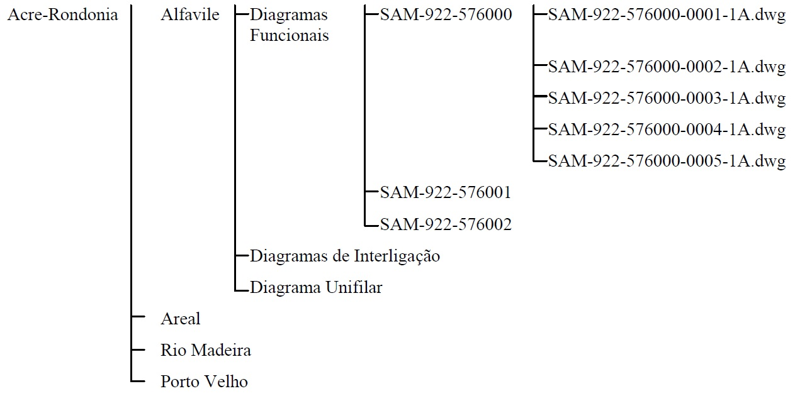

Eletronorte - SPCS - PEP-000-88102-0001-8

# NUMERAÇÃO DE DOCUMENTOS DA GERÊNCIA DE PROTEÇÃO, CONTROLE E AUTOMAÇÃO – EETP

## OBJETIVO

Esta Instrução Técnica tem por objetivo estabelecer os critérios para numeração dos documentos de projeto elaborados pela EETP ou por projetistas contratados, para aplicação nos projetos de proteção, controle e automação necessários à implantação dos empreendimentos da **ELETROBRAS ELETRONORTE**.

Todos os documentos de projeto devem ser numerados na forma convencional e através de meio magnético.

## CAMPO DE APLICAÇÃO

Aplica-se a todos os documentos de projeto a serem elaborados, sob a responsabilidade da Gerência de Proteção, Controle e Automação – EETP – seja internamente ou por projetistas contratados pela **ELETROBRAS ELETRONORTE**.

Os itens 3 e 5 desta instrução apresentam, respectivamente, as regras de formação para numeração dos documentos através da forma convencional e em meio magnético.

O item 4 descreve a regra de formação para numeração da revisão dos documentos que deverá também ser aplicada na forma convencional e em meio magnético.

## REGRA DE FORMAÇÃO PARA NUMERAÇÃO DOS DOCUMENTOS DE PROJETO NA FORMA CONVENCIONAL

Os documentos de projeto, quando numerados na forma convencional, são identificados por caracteres alfanuméricos pela seguinte regra de formação:

Regra de Formação: **AAA-BBB-CCDEEE**, sendo:

- **AAA** :arrow_right: Código de Identificação dos Sistemas de Transmissão
- **BBB** :arrow_right: Código de Identificação das Subestações
- **CC** :arrow_right: Código de Identificação do Assunto
- **D** :arrow_right: Código de Identificação do Nível de Tensão
- **EEE** :arrow_right: Código de Identificação do Número Sequencial do Documento

### IDENTIFICAÇÃO DOS SISTEMAS DE TRANSMISSÃO

Código identificador - (**AAA**) - Os Sistemas de Transmissão são identificados pelas três primeiras letras, sempre maiúsculas, que compõem o número do documento.

Exemplos:

- **TUC** :arrow_right: Sistema Norte - Nordeste
- **CMG** :arrow_right: Sistema Mato Grosso
- **MAO** :arrow_right: Sistema Manaus
- **ROR** :arrow_right: Sistema Roraima

Os códigos (**AAA**) estão representados no **PET-000-559001**.

### IDENTIFICAÇÃO DAS SUBESTAÇÕES

Código identificador - (BBB) - os documentos de aplicação das Subestações que compõem os Sistemas de Transmissão são identificados pelos três dígitos dispostos de forma subsequente àqueles que identificam os Sistemas de Transmissão e os Padrões de Projeto de Engenharia de Proteção, Controle e Automação mencionados no item 3.1.

Exemplos:

- BAP-**091**-SE Barra do Peixe
- MAR-**096**-SE Imperatriz
- BAL-**095**-SE Balbina
- SAM-**931**-SE Abunã

Esta regra não se aplica a documentos existentes a serem redesenhados. Tais
documentos devem manter rigorosamente sua numeração original.

- Os códigos (**BBB**) estão representados no **PET-000-559001**.

### IDENTIFICAÇÃO DO ASSUNTO

Código identificador - (**CC**) - que forma o terceiro campo do número e define o assunto a que se refere o documento. Os dígitos que integram esse campo, definidos previamente pela ELETROBRAS ELETRONORTE, são apresentados do quadro nº 1:

    Quadro nº 1 
    <b>IDENTIFICAÇÃO DO ASSUNTO</b>

| Código (**CC**) | Descrição                                          |
| :---------------------------------------: | :------------------------------------------------- |
|   **53 a 54**   | Reserva                                            |
|     **55**      | Especificações Técnicas - SPCS e Cablagem          |
|     **56**      | Diagramas Unifilares de Proteção e Medição         |
|     **57**      | Diagramas Funcionais e Trifilares (por Vão)        |
|     **58**      | Arquitetura Geral do Sistema                       |
|     **59**      | Memoriais Descritivos                              |
|     **60**      | Memória de Cálculo                                 |
|     **61**      | Relatório de Analise Técnica                       |
|     **62**      | Relatórios de Concepção                            |
|     **63**      | Previsão de Materiais                              |
|     **64**      | Reserva                                            |
|     **65**      | Manual Técnico                                     |
|     **66**      | Reserva                                            |
|     **67**      | Diagramas Lógicos (por Vão)                        |
|     **68**      | Desenho Construtivo (por Painel)                   |
|     **69**      | Documentos do Fabricante                           |
|     **70**      | Relatórios de Adequação                            |
|     **71**      | Lista Geral de Documentos da Subestação            |
|     **72**      | Diagramas de Interligação (por Vão)                |
|     **73**      | Lista de Ocupação de Eletrodutos                   |
|   **74 a 75**   | Reserva                                            |
|     **76**      | Cronogramas                                        |
|     **77**      | Níveis de Curto-Circuito                           |
|     **78**      | Logística de Implementação do SPCS                 |
|     **79**      | Roteiro de Teste – CFI (por Vão)                   |
|     **80**      | Biblioteca Cadgraph                                |
|     **81**      | Reserva                                            |
|     **82**      | Documentos Gerais                                  |
|     **83**      | a 86 Reserva                                       |
|     **87**      | Lista de Cabos (por Vão) e Ocupação de Eletrodutos |
|     **88**      | Instruções Técnicas de Projetos                    |
|     **89**      | Rotinas Internas                                   |
|     **90**      | Diagrama de Impedâncias                            |
|     **91**      | Consolidação de Fornecimento - Workstatement       |

### IDENTIFICAÇÃO DO NÍVEL DE TENSÃO

Código identificador - (**D**) - Para os projetos de Comando, Controle e Proteção, deverá ser utilizado o dígito conforme abaixo:

- **9** - Geral;
- **8** - Transmissão em Corrente Contínua;
- **7** - Acima 345kV;
- **6** - 230kV;
- **5** - 138kV;
- **4** - 69kV;
- **3** - 34,5kV;
- **2** - 13,8kV;
- **1** - Serviço Auxiliar.

> Obs.: Quando o documento do projeto for aplicado a mais de um nível de tensão, utilizar o código identificador (D) do maior nível de tensão.

### IDENTIFICAÇÃO DO NÚMERO SEQUENCIAL

Código identificador - (EEE) - finaliza a composição do campo três. O número sequencial do documento é definido pela ELETROBRAS ELETRONORTE pelos dígitos que compõem o intervalo de 000 e 099, segundo o critério apresentado no quadro nº 2.

    Quadro nº 2

| Numeração (EEE) |              Vão               | Numeração (EEE) caso já exista |   Vão   |
| :-------------: | :----------------------------: | :----------------------------: | :-----: |
|       000       |             Barras             |              060               | Barras  |
|       001       |               AX               |              061               |   AX    |
|       002       |               AY               |              062               |   AY    |
|       003       |               BX               |              063               |   BX    |
|       004       |               BY               |              064               |   BY    |
|       005       |               CX               |              065               |   CX    |
|       006       |               CY               |              066               |   CY    |
|       007       |               DX               |              067               |   DX    |
|       008       |               DY               |              068               |   DY    |
|       009       |               EX               |              069               |   EX    |
|       010       |               EY               |              070               |   EY    |
|       011       |               FX               |              071               |   FX    |
|       012       |               FY               |              072               |   FY    |
|       013       |               GX               |              073               |   GX    |
|       014       |               GY               |              074               |   GY    |
|       015       |               HX               |              075               |   HX    |
|       016       |               HY               |              076               |   HY    |
|       017       |               IX               |              077               |   IX    |
|       018       |               IY               |              078               |   IY    |
|       019       |               JX               |              079               |   JX    |
|       020       |               JY               |              080               |   JY    |
|       021       |               KX               |              081               |   KX    |
|       022       |               KY               |              082               |   KY    |
|       023       |               LX               |              083               |   LX    |
|       024       |               LY               |              084               |   LY    |
|       025       |               MX               |              085               |   MX    |
|       026       |               MY               |              086               |   MY    |
|       027       |               NX               |              087               |   NX    |
|       028       |               NY               |              088               |   NY    |
|       029       |            Reserva             |              089               | Reserva |
|       030       |              A1X               |              090               |   A1X   |
|       031       |              A1Y               |              091               |   A1Y   |
|       032       |              B1X               |              092               |   B1X   |
|       033       |              B1Y               |              093               |   B1Y   |
|       034       |              C1X               |              094               |   C1X   |
|       035       |              C1Y               |              095               |   C1Y   |
|       036       |              D1X               |              096               |   D1X   |
|       037       |              D1Y               |              097               |   D1Y   |
|       038       |              E1X               |              098               |   E1X   |
|       039       |              E1Y               |              099               |   E1Y   |
|       040       |            Reserva             |                                |         |
|       041       |            Reserva             |                                |         |
|       042       |            Reserva             |                                |         |
|       043       |            Reserva             |                                |         |
|       044       |            Reserva             |                                |         |
|       045       |            Reserva             |                                |         |
|       046       |            Reserva             |                                |         |
|       047       |            Reserva             |                                |         |
|       048       |            Reserva             |                                |         |
|       049       |            Reserva             |                                |         |
|       050       |          Paralelismo           |                                |         |
|       051       |              SEP               |                                |         |
|       052       | Painel Transf. (Transformador) |                                |         |
|       053       |            Reserva             |                                |         |
|       054       |            Reserva             |                                |         |
|       055       |               MF               |                                |         |
|       056       |               MF               |                                |         |
|       057       |               MF               |                                |         |
|       058       |            Reserva             |                                |         |
|       059       |            Reserva             |                                |         |

Os documentos: Diagrama Funcional e Trifilar (57), Diagrama Lógico (67), Diagrama de Interligação (72) e Lista de Cabos (87), relativos ao mesmo bay, deverão ter preferencialmente a mesma formação numérica para as identificações (**D**) e (**EEE**).

Para o Desenho Construtivo (68) o campo (**EEE**) deverá ter o seu primeiro dígito eliminado e utilizar a seguinte regra (**EEF**), onde a letra (**F**) é um número sequencial correspondente a quantidades de painéis.

## REGRA DE FORMAÇÃO PARA NUMERAÇÃO DA REVISÃO DE DOCUMENTOS DE PROJETO

É aplicada em todos os documentos emitidos para a EETP, na forma convencional ou em meio magnético. Os campos destinados a revisão dos documentos deverão ser preenchidos de acordo com as seguintes instruções:

Na fase de aprovação dos documentos técnicos, a indicação das revisões deverá ser alfanumérica. Em sua primeira emissão, o documento deverá receber a indicação da letra maiúscula “**A**”, no campo destinado à anotação das revisões. Caso sejam necessárias outras revisões, antes do documento ser considerado aprovado, as mesmas deverão ser indicadas pelas letras maiúsculas, seguindo a ordem alfabética, ou seja, “**B**”, “**C**”, “**D**”, etc.

Após a primeira aprovação do documento, as revisões indicadas por letras do alfabeto deverão ser excluídas e o documento deverá receber a indicação de revisão “**0**” (**Zero**).

Caso sejam necessárias outras revisões no documento, após sua primeira aprovação, as mesmas deverão ser indicadas por caracteres alfanuméricos, seguindo a ordem alfabética: **0A**, **0B**, **0C**, etc., até nova aprovação, quando receberá a indicação **1** (**um**) no campo apropriado, repetindo este procedimento sempre que se fizer necessário.

Exemplos de Números de Documentos:

- **CMG-094-576000** - Diagramas Funcionais do Banco de Capacitores de 230kV - 30 MVAR, da SE de Rondonópolis – **Rev. A**
- **CMG-094-726000** - Diagrama de Interligação do Banco de Capacitores de 230kV - 30 MVAR, da SE de Rondonópolis. – **Rev. 1**

## REGRA DE FORMAÇÃO PARA NUMERAÇÃO DE DOCUMENTOS DE PROJETO EM MEIO MAGNÉTICO

Da mesma forma que os documentos gerados em meio convencional, quando arquivados em meio magnético, os documentos são identificados por caracteres alfanuméricos, tendo sua numeração a seguinte regra de formação:

Regra de Formação: **AAA-BBB-CCDEEE-GGGG-HHH**

Os códigos **AAA**, **BBB**, **CC**, **D** e **EEE**, são os mesmos utilizados na formação dos números dos documentos emitidos na forma convencional.

Os códigos **GGGG** e **HHH** correspondem, respectivamente, à identificação do número sequencial do arquivo magnético e ao número da revisão do documento.

### IDENTIFICAÇÃO DO NÚMERO SEQUENCIAL DO ARQUIVO MAGNÉTICO

Código identificador - (**GGGG**) - indica o número sequencial do arquivo magnético, sendo formado alfanumérico por 4 características.

Os arquivos magnéticos do tipo **doc**, **mpp**, **xls** e **mdb**, respectivamente, extensões do Word, Project, Excel e do Access, são identificados por **0001**, sendo que as folhas internas serão sequenciais.

As páginas dos documentos que utilizam os arquivos do tipo **dwg**, extensão do Autocad, são identificadas individualmente, ou seja, cada folha corresponde a um único número.

Os arquivos dos Projetos Automatizados devem seguir as instruções indicadas no **PEP-000-889001**.

### REQUISITOS DE HARDWARE DO SCDS

Código identificador - (**HHH**) - que indica o número da revisão do documento no arquivo magnético. Este campo deve ser idêntico, inclusive com a mesma quantidade de caracteres alfanuméricos (de 1 a 3 dígitos), ao número que indica a revisão do respectivo documento na forma convencional.

Exemplos de Números de Documentos:

- **CMG-094-576000-0001-A** – Diagramas Funcionais - Banco de Capacitores de 230kV - 30 MVAr, da SE de Rondonópolis;
- **CMG-094-726000-0001-12** – Diagrama de Interligação - Banco de Capacitores de 230kV - 30 MVAr, da SE de Rondonópolis;
- **CMG-096-726000-001A-10A** – Diagrama de Interligação - Banco de Capacitores de 230kV - 30 MVAr, da SE de Coxipó.

### ESTRUTURA PARA A CONFECÇÃO DO CD

Para a gravação, em CD, dos arquivos magnéticos a serem encaminhados para a EETP, considerar a seguinte estrutura:

Sistema – Subestação – Tipo de Documento – N.º do Caderno – Documentos – Data

Exemplo de uma estrutura:

O envio dos documentos de projeto deverá ser através de CD gravado, contendo todos os arquivos distribuídos em pastas, seguindo a seguinte ordenação:

Sistema – Subestação – Tipo do Documento – Nº do caderno – Documentos

Exemplos de estrutura:

Uma cópia comprimida de todo o conteúdo do CD, utilizando-se padrão tipo zip, deverá ser instalado na pasta principal do CD – diretório raiz.

> Obs.: Somente deverão ser enviados os arquivos magnéticos que sofrerem revisão.

## APLICAÇÃO DE REFERÊNCIA

    <b>SE PRESIDENTE DUTRA - 500/230/69kV</b>

|                                                                        Código                                                                         | Descrição                                                |
| :---------------------------------------------------------------------------------------------------------------------------------------------------: | :------------------------------------------------------- |
| AAA-BBB-CCDEEE-GGGG-HHH MAR-095-567000-0001-1  | Diagramas Unifilares de Proteção e Medição - Setor 500kV |
| AAA-BBB-CCDEEE-GGGG-HHH  MAR-095-566000-0001-1 | Diagramas Unifilares de Proteção e Medição - Setor 230kV |
| AAA-BBB-CCDEEE-GGGG-HHH  MAR-095-564000-0001-1 | Diagramas Unifilares de Proteção e Medição - Setor 69kV  |
| AAA-BBB-CCDEEE-GGGG-HHH  MAR-095-577008-0001-1 | Diagramas Funcionais e Trifilares                        |
| AAA-BBB-CCDEEE-GGGG-HHH  MAR-095-677008-0001-A | Diagramas Lógicos (por Vão)                              |
| AAA-BBB-CCDEEE-GGGG-HHH  MAR-095-727008-0001-A | Diagramas de Interligação                                |
| AAA-BBB-CCDEEE-GGGG-HHH  MAR-095-877008-0001-A | Lista de Cabos                                           |
| AAA-BBB-CCDEEE-GGGG-HHH  MAR-095-589000-0001-A | Arquitetura Geral do Sistema                             |
| AAA-BBB-CCDEEF-GGGG-HHH  MAR-095-687080-0001-A | Desenho Construtivo – QPC1                               |
| AAA-BBB-CCDEEF-GGGG-HHH  MAR-095-687081-0001-A | Desenho Construtivo – QPC2                               |
| AAA-BBB-CCDEEE-GGGG-HHH  MAR-095-70XXXX-0001-A | Relatórios de Adequação. (NOTA 1)                        |
| AAA-BBB-CCDEEE-GGGG-HHH  MAR-095-719000-0001-A | Lista Geral de Documentos da Subestação                  |
| AAA-BBB-CCDEEE-GGGG-HHH  MAR-095-917008-0001-A | Consolidação de Fornecimento - Workstatement             |

> Nota 1: Número definido pela Eletronorte de acordo com o empreendimento e com as etapas necessárias.

