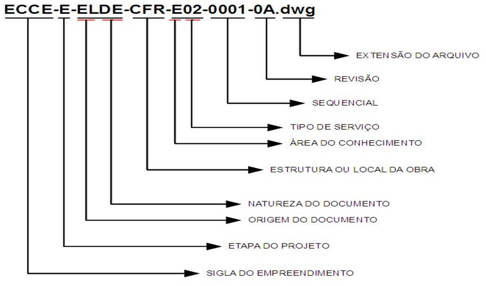
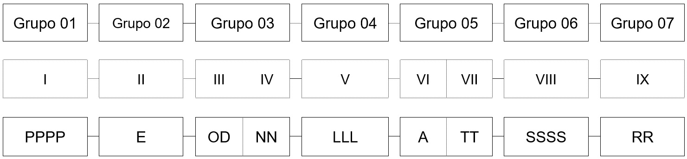
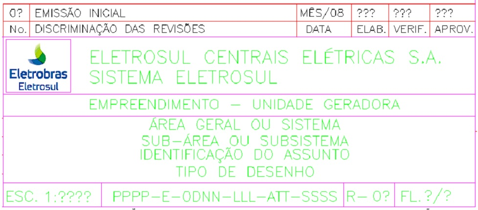
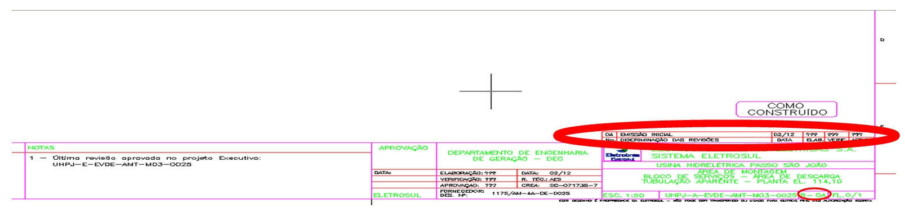
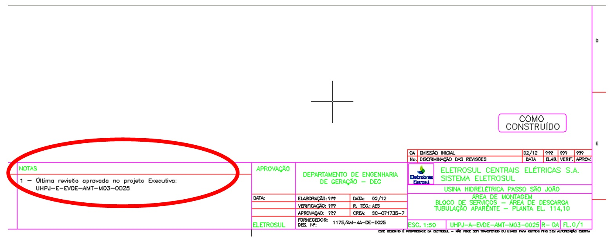

CGTEletrosul - GERAÇÃO - DEGG-G-ELPQ-GRL-Q11-0001-0 - Procedimento para Codificação

# Procedimento de Codificação, Tramitação e Elaboração de Documentos

## OBJETIVO

Estabelecer a sistemática de codificação e identificação dos documentos técnicos e administrativos gerados para a realização dos empreendimentos de geração de energia, de forma a facilitar o arquivamento, a localização e o controle dessa documentação.

## APLICAÇÃO

Aplica-se aos documentos técnicos de projeto (civil, elétrico, mecânico e ambiental), documentos de natureza gerencial (planos, procedimentos, cronogramas, relatórios, parecer, etc), documentos de natureza operacional (procedimentos executivos, instruções, listas de verificação, etc), documentos de comunicação (cartas, memorandos, atas, guias de remessa, etc), documento da segurança do trabalho, meio ambiente e documentos administrativos como apropriado. 

## TERMOS E REFERÊNCIAS

### Termos

1. DEG – Departamento de Engenharia de Geração;
2. DEGG – Assuntos Gerais do DEG;
3. DEPG – Divisão de Engenharia de Projeto de Geração;
4. DPCG - Divisão de Planejamento e Contratação da Geração ;
5. DVOG – Divisão de Obras de Geração.

### Referências

1. NBR ISO 9001:2000 Sistema de Gestão da Qualidade – Requisitos.

## RESPONSABILIDADES

- Área de Documentação: Elaborar, revisar, avaliar e divulgar este documento;
- Gerente de Divisão: Aprovar, verificar e sugerir melhorias para este documento;
- Demais colaboradores: Seguir a sistemática estabelecida e propor melhorias;
- Contratados: Seguir a sistemática estabelecida neste Procedimento.

## DESCRIÇÃO DO PROCESSO

### Generalidades

1. Todos os documentos gerados para realização dos empreendimentos de geração de energia devem ser codificados e identificados de acordo com a sistemática estabelecida nesta Norma.
2. Essa norma tem atualização constante e a sua versão válida será sempre a mais atual.
3. Nos casos em que não seja possível o enquadramento de um documento específico, de acordo com a codificação aqui estabelecida, o DEG deve ser consultado, antes da emissão do documento.
4. A codificação de desenhos, diagramas e demais documentos de projeto deve ser posicionada em local e nas dimensões apropriadas ao tipo de documento. 
5. Para os demais documentos técnicos de projeto, tais como memorial descritivo, memória de cálculo, relatórios etc, e documentos gerenciais, tais como procedimentos do sistema da qualidade (ex. auditoria, soldagem etc) e manuais (p.ex. operação, manutenção etc), a sua elaboração e codificação deve seguir o layout e a estética apresentados nesta Norma, incluindo-se a capa, o índice e demais páginas.
6. As cópias físicas dos documentos técnicos de projeto, a serem entregues pela **CONTRATADA**, devem ser impressas em papel tipo sulfite, na cor branca, com gramatura 90 g / m2;
7. Os nomes dos arquivos enviados em meio eletrônico devem ser formados pela codificação conforme estabelecido neste procedimento.

`Exemplo de código:` 
**PPPP-E-ODNN-LLL-ATT-SSSS**

### Estrutura da Codificação

| Grupo | Item  | Código | Descrição                                 |
| :---: | :---: | :----: | :---------------------------------------- |
|  01   |   I   |  PPPP  | Sigla do Projeto ou Empreendimento        |
|  02   |  II   |   E    | Etapa do Projeto                          |
|  03   |  III  |   OD   | Origem do Documento                       |
|  03   |  IV   |   NN   | Natureza do Documento                     |
|  04   |   V   |  LLL   | Estrutura ou Local da Obra                |
|  05   |  VI   |   A    | Área de Conhecimento                      |
|  05   |  VII  |   TT   | Tipo de Serviço ou Sistema Eletromecânico |
|  06   | VIII  |  SSSS  | Número Sequencial                         |
|  07   |  IX   |   RR   | Numeração de Revisão do Documento         |

#### Grupo 01

**Item I**: PPPP – Código do Projeto ou Empreendimento (Máximo 04 caracteres);

1. Projetos Internos (Gerenciais, Administrativos, Coordenação)
   
    | Código | Descrição                                                                            |
    | :----: | :----------------------------------------------------------------------------------- |
    |  DEPG  | Projetos, Serviços e Trabalhos da Divisão de Engenharia de Projeto de Geração        |
    |  DPCG  | Atividades, Serviços e Trabalhos da Divisão de Planejamento e Contratação da Geração |
    |  DVOG  | Atividades, Serviços e Trabalhos da Divisão de Obras de Geração                      |

2. Empreendimentos (exemplos)

    | Código | Descrição                         |
    | :----: | :-------------------------------- |
    |  UHPJ  | Usina Hidrelétrica Passo São João |
    |  UHSD  | Usina Hidrelétrica São Domingos   |
    |  UHJB  | PCH João Borges                   |
    |  UHBC  | PCH Barra do Rio Chapéu           |
    |  UHSC  | PCH Santo Cristo                  |
    |  UECC  | Usina Eólica Cerro Chato          |
    |  ECCE  | Eólica Cerro Chato Entorno        |

#### Grupo 02

**Item II**: E = Etapa do Projeto / Processo (Máximo 02 caracteres)

1. Etapas do Projeto / Empreendimento:

    | Código | Descrição                                            |
    | :----: | :--------------------------------------------------- |
    |   G    | Geral (Administrativo/Organização)                   |
    |   I    | Estudos de Inventário                                |
    |   V    | Estudos de Viabilidade                               |
    |   P    | Projeto Básico Preliminar                            |
    |   B    | Projeto Básico Consolidado                           |
    |   E    | Projeto Executivo, Fabricação, Construção e Montagem |

2. Processos Internos de Coordenação e Planejamento:

    | Código | Descrição                                 |
    | :----: | :---------------------------------------- |
    |   L    | Processo de Licitação                     |
    |   C    | Coordenação/Gestão Contratual             |
    |   A    | As Built                                  |
    |   N    | Avaliação Técnica - Novos Empreendimentos |
    |   F    | Fabricação                                |
			
**Nota**: A seguir o conteúdo dos documentos referente às etapas / processos de um projeto ou empreendimento:

| Código | Documentos                                                                                                                                                                                                                              |
| :----: | :-------------------------------------------------------------------------------------------------------------------------------------------------------------------------------------------------------------------------------------- |
|   G    | Geral: documentos institucionais, comunicações, diversos, que não se enquadram em uma das demais classificações apresentadas;                                                                                                           |
|   I    | Inventário: estudos e levantamentos técnicos iniciais para o empreendimento                                                                                                                                                             |
|   V    | Estudo de Viabilidade: estudos técnicos e econômicos, laudos, prospecções que possam caracterizar viabilidade do empreendimento                                                                                                         |
|   P    | Projeto Básico Preliminar pode ser tomado como referência para os projetos a serem desenvolvidos sob a coordenação da Eletrosul                                                                                                         |
|   B    | Projeto Básico desenvolvidos sob a coordenação da Eletrosul. Pode assumir o caráter de consolidado, o quê significa que existe um Projeto Básico                                                                                        |
|   E    | Projeto Executivo: documentos técnicos de projeto para realização do empreendimento (desenhos, diagramas, listas, especificações técnicas, critérios de projeto, relatórios, etc.)                                                      |
|   L    | Licitação: documentos referentes a processos licitatórios (orçamento básico, edital, requisição de serviço)                                                                                                                             |
|   C    | Coordenação / Gestão Contratual: Contrato (Aditivos, ARTs, Ordem de Serviço, etc.), Comunicações (RAD, Análise Jurídica, DD, RCA, Publicações Legais, Administração do Contrato, Atas, e-mails, CE, CI, Relatórios Mensais, Memorandos) |
|   A    | As Built, "Como Construído". Levantamento das medidas realizadas na obra, criando um registro das mesmas                                                                                                                                |
|   N    | Avaliação Técnica de Novos Empreendimentos: Relatório de estudos, visita de campo, visita técnica, relatório de viagens etc                                                                                                             |
|   F    | Fabricação: Fabricação de bens que serão incorporados aos empreendimentos de geração de energia elétrica                                                                                                                                |
|   U    | Aquisição de Empreendimentos: Documentos dentro do escopo do DEG, referentes à aquisição dos empreendimentos                                                                                                                            |

#### Grupo 03

**Item III**: OD = Origem do Documento (Máximo 02 Caracteres)

1. Cada contrato de fornecimento demanda uma identificação da origem do documento de forma particular, pois envolve a emissão de documentos técnicos de projeto por empresas (projetistas) contratadas.
2. Para a codificação da origem do documento, por parte de uma empresa contratada esta deve utilizar somente dois caracteres alfabéticos que serão fornecidos pelo gestor do sistema de gerenciamento eletrônico de documentos utilizado pela contratante.
3. As empresas e organizações terão seus códigos de identificação cadastrados no sistema de Gerenciamento de documentos utilizado pela Eletrosul.
4. Segue lista com os principais códigos:

    | Código | Descrição                                                              |
    | :----: | :--------------------------------------------------------------------- |
    |   CC   | Consórcio Construtor                                                   |
    |   CV   | Contratado Civil – Projeto Executivo e Obras                           |
    |   DV   | Diversos (contratos rápidos)                                           |
    |   EL   | Eletrobrás Eletrosul                                                   |
    |   EM   | Contratado Eletromecânico – Projeto Executivo, Equipamentos e Montagem |
    |   EP   | Engenharia do Proprietário                                             |

**Item IV**: NN = Natureza do Documento (Máximo 02 caracteres)

- Comunicações

    | Código | Legenda                              | Descrição                                                                                                   |
    | :----: | :----------------------------------- | :---------------------------------------------------------------------------------------------------------- |
    |   AI   | Auto de infração                     | Auto-explicativo                                                                                            |
    |   AR   | Aviso de Recebimento                 | Aviso de recebimento dos Correio                                                                            |
    |   AT   | Ata de reunião                       | Auto-explicativo                                                                                            |
    |   BM   | Boletim de Medição                   | Boletim que atesta a medição de um evento financeiro e a respectiva aprovação para pagamento                |
    |   CE   | Carta externa                        | Correspondência formal e protocolar com organizações externas                                               |
    |   CI   | Carta interna                        | Correspondência formal e protocolar com órgãos e setores internos                                           |
    |   CO   | Comunicação de Obra                  | Correspondência formal utilizada entre envolvidos no âmbito da obra;                                        |
    |   CV   | Convocação de Inspeção               | Auto-explicativo                                                                                            |
    |   DP   | Despacho                             | Despacho administrativo, normalmente emitido por organismos e ou instituição reguladora, por exemplo, ANNEL |
    |   IN   | Informativo                          | Informações gerais de natureza técnica, administrativa ou organizacional                                    |
    |   EE   | e-mail                               | Mensagem por correio eletrônico                                                                             |
    |   FX   | Fax                                  | Auto-explicativo                                                                                            |
    |   LE   | Certificado de Liberação de Embarque | Envio de materiais e equipamentos                                                                           |
    |   LM   | Logo Marca                           | Auto-explicativo                                                                                            |
    |   ME   | Memorando                            | Auto-explicativo                                                                                            |
    |   MP   | Modificação de Projeto               | Comunicação de solicitação à projetista de modificações de Projeto                                          |
    |   NC   | Não Conformidade                     | Documento que aponta não conformidade na obra                                                               |
    |   NT   | Nota Técnica                         | Auto-explicativo                                                                                            |
    |   OF   | Ofício                               | Auto-explicativo                                                                                            |
    |   PR   | Procuração                           | Auto-explicativo                                                                                            |
    |   RA   | Resolução Autorizativa               | Resolução emitida pela ANEEL                                                                                |
    |   RD   | Remessa de Documentos                | Auto-explicativo                                                                                            |
    |   RL   | Relatório                            | De resultados, de estudo técnico, de levantamento de campo, de progresso, técnico, de inspeção              |
    |   SI   | Solicitação de Inspeção              | Auto-explicativo                                                                                            |
    |   TN   | Termo de Notificação                 | Termo de Notificação. Em especial ref ANEEL                                                                 |

- Desenhos Técnicos

    | Código | Legenda    | Descrição                                                                                                                                                           |
    | :----: | :--------- | :------------------------------------------------------------------------------------------------------------------------------------------------------------------ |
    |   DE   | Desenho    | Planta, curva de níveis, tabela, ábaco, gráfico, croqui, diagrama (unifilar, lógico, interligação, de cablagem), fluxograma, anteprojeto e símbolos, detalhe típico |
    |   DI   | Diagrama   | Diagrama unifilar, esquemático, etc                                                                                                                                 |
    |   IS   | Isométrico | Específico para desenhos em axometria ou em perspectiva cavaleira de sistemas de tubulações                                                                         |

- Documento Técnico

    | Código | Legenda                                   | Descrição                                                                                                                                                                                                                                                |
    | :----: | :---------------------------------------- | :------------------------------------------------------------------------------------------------------------------------------------------------------------------------------------------------------------------------------------------------------- |
    |   AC   | Autorização de corte                      | Documento Ambiental                                                                                                                                                                                                                                      |
    |   AE   | Alteração de Escopo                       | Registro de alteração de especificação técnica contratual                                                                                                                                                                                                |
    |   CC   | Confirmação de Compra                     | Documento de natureza técnico-administrativa que indica a confirmação de uma aquisição                                                                                                                                                                   |
    |   CD   | Compact Disc                              | Documentação encaminhada em CD                                                                                                                                                                                                                           |
    |   CF   | Certificado                               | Certificados de inspeção, de conclusão de montagem, de aferição de instrumentos, de auditoria, entre outros                                                                                                                                              |
    |   CL   | Coletânea de documentos                   | Auto-explicativo                                                                                                                                                                                                                                         |
    |   CM   | Comentário Técnico                        | Parecer destinado ao esclarecimento ou resposta tema de engenharia                                                                                                                                                                                       |
    |   CP   | Critério de Projeto                       | Requisito sob o qual se baseiam as especificações de um determinado projeto                                                                                                                                                                              |
    |   CR   | Cronograma                                | Diagramas de barras, de caminho crítico e assemelhado                                                                                                                                                                                                    |
    |   DB   | Data Book                                 | Coleção de registros que comprovam a qualidade requerida e especificada para partes, peças, componentes e sub-sistemas                                                                                                                                   |
    |   DO   | Diário de Obra                            | Registro que contém as informações diárias do empreendimento, tais como: quantitativo de pessoal, de equipamentos, condições climáticas, ocorrências diversas etc                                                                                        |
    |   DR   | Diretriz                                  | Documento que orienta a realização de projetos, planos e procedimentos de acordo com critérios, normas, leis e regulamentos vigentes                                                                                                                     |
    |   ES   | Estudos                                   | Estudos e análises de engenharia que possam subsidiar a tomada de decisão por parte da gerência                                                                                                                                                          |
    |   ET   | Especificação Técnica                     | Critérios de projeto, especificação de materiais, sistemas e equipamentos, especificação de processo ou instalações                                                                                                                                      |
    |   FD   | Folha de Dados                            | De equipamento, de sistemas, de material a granel (partes, peças e componentes), de processo, de instrumento, de tubulação (lista de linhas)                                                                                                             |
    |   FC   | Ficha Técnica                             | Registros com dados técnicos de empreendimentos, estrutura, equipamentos etc                                                                                                                                                                             |
    |   FO   | Fotografias                               | Auto-explicativo                                                                                                                                                                                                                                         |
    |   FT   | Função de Transferência                   | Contém diagrama de bloco com os parâmetros do sistema                                                                                                                                                                                                    |
    |   IC   | Instrução de Campo                        | Sistemática de trabalhos a serem realizados no campo ou obra                                                                                                                                                                                             |
    |   IM   | Imagem ou foto                            | Projeção cartográfica de apresentação de uma localidade                                                                                                                                                                                                  |
    |   IN   | Informativo                               | Informações gerais de natureza técnica, administrativa e organizacional                                                                                                                                                                                  |
    |   IT   | Instrução de Trabalho                     | Rotina operacional detalhada. Instrui o usuário como realizar efetivamente uma atividade                                                                                                                                                                 |
    |   LA   | Licença Ambiental                         | Licença Ambiental de Instalação                                                                                                                                                                                                                          |
    |   LD   | Laudo                                     | Parecer envolvendo aspectos de engenharia emitidos para fins legais do tipo: processo formal de partilha, de perícia ou avaliação, perícia ambiental e assemelhada                                                                                       |
    |   LI   | Listas                                    | Relação de equipamentos, de instrumentos, de materiais, de suportes, de cabos, de documentos, de pontos, de sinais. Nota: A codificação para Listas                                                                                                      |
    |   LG   | Log                                       | De sondagem, de sinais elétricos, de sinais digitais                                                                                                                                                                                                     |
    |   LP   | Licença Previa                            | Licença Ambiental                                                                                                                                                                                                                                        |
    |   MA   | Manual                                    | De ensaios e testes, de comissionamento, de operação, de montagem, de manutenção, da qualidade                                                                                                                                                           |
    |   MC   | Memória de Cálculo                        | Memória de cálculo e análise de soluções técnicas de projeto                                                                                                                                                                                             |
    |   MD   | Memorial Descritivo                       | Documento que descreve um conjunto de atividades, serviços ou processos, e outros                                                                                                                                                                        |
    |   MR   | Material de Referência                    | Documentos de caráter técnico armazenados para consultas por parte dos usuários                                                                                                                                                                          |
    |   NC   | Não Conformidade                          | Documento que aponta não conformidade na obra                                                                                                                                                                                                            |
    |   NO   | Norma                                     | Documento de caráter administrativo e disciplinar                                                                                                                                                                                                        |
    |   NT   | Nota Técnica                              | Apontamento formal de caráter técnico                                                                                                                                                                                                                    |
    |   OC   | Ordem de Compra                           | Auto-explicativo                                                                                                                                                                                                                                         |
    |   OG   | Organograma                               | Estrutura Organizacional para realização de projeto, contrato ou empreendimento                                                                                                                                                                          |
    |   OR   | Orçamento                                 | Apontamento orçamentário para equipamentos, subsistemas e serviços correlatos aos projetos e empreendimentos                                                                                                                                             |
    |   PC   | Placa                                     | Placa de sinalização, registro, regulamentação ou informação                                                                                                                                                                                             |
    |   PD   | Padrão                                    | Documento, formulário ou modelo utilizado para uniformizar a apresentação de conteúdo técnico                                                                                                                                                            |
    |   PE   | Procedimento Executivo                    | Procedimento de execução de serviços de campo ou obra                                                                                                                                                                                                    |
    |   PN   | Penas                                     | Penas padrões para elaboração e impressão de desenhos                                                                                                                                                                                                    |
    |   PL   | Plano                                     | Planejamento ou programação de atividades tais como: inspeção, levantamento, execução, etc                                                                                                                                                               |
    |   PQ   | Procedimento da Qualidade                 | Diretrizes e sistemáticas para o gerenciamento das atividades e garantia da qualidade: rotina de trabalho, instrução executiva                                                                                                                           |
    |   PT   | Parecer Técnico                           | Parecer para aquisição de sistemas, equipamentos e materiais                                                                                                                                                                                             |
    |   QD   | Quadro                                    | Auto-explicativo                                                                                                                                                                                                                                         |
    |   RA   | Relatório de Acompanhamento de Fabricação | Relatório de vistoria em Fábrica                                                                                                                                                                                                                         |
    |   RG   | Registro                                  | Documento comprobatório da realização de atividades e características apontadas: de ensaios não destrutivos, de pintura, de teste de isolamento, de inspeção, de controle da qualidade, de flushing, de decapagem, de teste hidrostático, ata de reunião |
    |   RI   | Relatório de Inspeção                     | Gerado em visitas técnicas                                                                                                                                                                                                                               |
    |   RL   | Relatório                                 | De resultados, de estudo técnico, de levantamento de campo, de progresso, técnico, de inspeção                                                                                                                                                           |
    |   RM   | Requisição de Material                    | Documento para aquisição de sistema, equipamentos e materiais                                                                                                                                                                                            |
    |   SW   | Software                                  | Auto-explicativo                                                                                                                                                                                                                                         |
    |   TB   | Tabelas                                   | Auto-explicativo                                                                                                                                                                                                                                         |
    |   TE   | Terminologia                              | Termos, expressões, conceitos e definições a serem utilizadas nos documentos técnicos e gerenciais do empreendimento                                                                                                                                     |
    |   TN   | Termo de Notificação                      | Termo de Notificação. Em especial ref ANEEL                                                                                                                                                                                                              |

- Gestão Contratual

    | Código | Legenda                  | Descrição                                                                                                    |
    | :----: | :----------------------- | :----------------------------------------------------------------------------------------------------------- |
    |   AS   | Termo de Assunção        | Contratos assumidos pela Eletrosul decorrentes de contratos terceirizados arrolados em contratação anterior  |
    |   CT   | Contrato                 | Auto-explicativo                                                                                             |
    |   ED   | Edital                   | Auto-explicativo                                                                                             |
    |   FA   | Fatura                   | Auto-explicativo                                                                                             |
    |   GC   | Gestão de Custos         | Interrelação entre BM – ACEC (Custos Informais)                                                              |
    |   MR   | Material de Referência   | Documentos de caráter técnico armazenados para consultas por parte dos usuários                              |
    |   OC   | Ordem de Compra          | Documento de natureza técnico-administrativa que indica a confirmação de uma aquisição                       |
    |   OS   | Ordem de Serviço         | Documento que autoriza uma contratada a iniciar uma prestação de serviço sob o amparo de um contrato firmado |
    |   SA   | Solicitação de Auditoria | Auto-explicativo                                                                                             |
    |   SE   | Apólice de Seguros       | Auto-explicativo                                                                                             |
    |   TA   | Termo Aditivo            | Termo aditivo contratual                                                                                     |

#### Grupo 04

**Item V**: LLL = Estrutura do Projeto ou Local da Obra (Máximo 03 caracteres)

> **Nota**: O código GRL (Geral) pode ser utilizado para documentos relacionados com mais de uma unidade da obra, ou representar um documento de natureza sistêmica. Alguns exemplos de documentos com estas características são:
>
> - Critério de projeto (CP);
> - Estudos (ES);
> - Listas (LI);
> - Norma (NO);
> - Plano (PL);
> - Procedimento da Qualidade (PQ);
> - Relatório (RL);
> - Registro (RG);
> - Remessa de Documento (RD);
> - Padrão (PD);

- Conjunto de termos típicos de obras de construção e montagem eletromecânica de usinas hidrelétricas. Podem ser utilizados, como apropriado, para demais tipos de usinas geradoras:

    | Código | Legenda                                 |
    | :----: | :-------------------------------------- |
    |  ACI   | Acessos Internos                        |
    |  ALM   | Almoxarifado                            |
    |  AMT   | Área de Montagem                        |
    |  BCT   | Barragem de Concreto e Transições       |
    |  BDT   | Barragem e Diques de Terra              |
    |  CAD   | Canal de Adução                         |
    |  CFG   | Canal de Fuga                           |
    |  CFR   | Casa de Força                           |
    |  CGE   | Circuito de Geração                     |
    |  CHA   | Chaminé de Equilíbrio                   |
    |  CNX   | Conexão ao Sistema Interligado Nacional |
    |  COB   | Canteiro de Obras                       |
    |  DSR   | Desvio do Rio                           |
    |  EAC   | Estradas e Acesso                       |
    |  ECR   | Edifício de Controle                    |
    |  ENC   | Ensecadeira                             |
    |  FUG   | Túnel de Fuga                           |
    |  GCA   | Galerias de Cabos                       |
    |  GER   | Gerador*                                |
    |  GRL   | Geral do Empreendimento                 |
    |  LTR   | Linha de Transmissão                    |
    |  OAC   | Obras de Apoio e Complementares         |
    |  OCV   | Obras Civis                             |
    |  ORS   | Obras do Reservatório                   |
    |  PON   | Pontes, Passarelas                      |
    |  PLV   | Plano Viário                            |
    |  REL   | Casa de Relés da Subestação             |
    |  RES   | Reservatório                            |
    |  RMT   | Rede de Média Tensão                    |
    |  SBI   | Subestação Interligadora                |
    |  SBC   | Subestação Coletora                     |
    |  SBE   | Subestação da Usina                     |
    |  SUC   | Tubo de Sucção                          |
    |  TAC   | Túnel de Acesso                         |
    |  TAD   | Túnel de Adução                         |
    |  TAG   | Tomada d´Água                           |
    |  TFO   | Conduto Forçado, Túnel Forçado          |
    |  TRE   | Transformador de Elevação               |
    |  TUD   | Túneis de Desvio                        |
    |  TUR   | Turbina*                                |
    |  UG1   | Unidade Geradora 1                      |
    |  UG2   | Unidade Geradora 2                      |
    |  UG3   | Unidade Geradora 3                      |
    |  UGR   | Unidade Geradora Reserva                |
    |  USI   | Usina                                   |
    |  VAZ   | Vazão Sanitária                         |
    |  VRT   | Vertedouro                              |

> __*__ Somente para documentos de fabricação. Para documentos do projeto executivo e montagem eletromecânica deve-se utilizar CFR como Estrutura ou local da Obra, a Área do Conhecimento correspondente (C, E, M) e o respectivo Subsistema. Neste caso específico Turbina, ou para os demais, por exemplo, Gerador.

- Conjunto de termos típicos para obras de construção e montagem eletromecânica de usinas eólio-elétrica:

    | Código | Legenda                                |
    | :----: | :------------------------------------- |
    |  A00   | Aerogerador – Geral                    |
    |  M00   | Módulo de Agrupamento de Aerogeradores |
    |  N00   | Nacele - Geral                         |
    |  T00   | Torre Eólica - Geral                   |
    |  ANM   | Anemômetros                            |
    |  CDA   | Coletor de Dados Anemométricos         |
    |  ESM   | Estação de Monitoramento               |
    |  MSO   | Módulo Solar                           |
    |  PQE   | Parque Eólico                          |
    |  SDV   | Sensor de direção de vento             |
    |  TOR   | Torre de Medição                       |

> **Nota**: Caso uma determinada Estrutura do Projeto ou Local da Obra, típica de usinas eólico-elétricas, não esteja contemplada nesta lista, o setor de coordenação da engenharia da contratante deverá ser consultada para que esta possa ser incluída na listagem do Grupo 4.

#### Grupo 05

**Item VI**: A: Área de Conhecimento (Máximo 01 caractere)

| Código | Legenda                         |
| :----: | :------------------------------ |
|   G    | Geral                           |
|   P    | Coordenação e Planejamento      |
|   Q    | Qualidade                       |
|   C    | Engenharia Civil                |
|   E    | Engenharia Elétrica             |
|   M    | Engenharia Mecânica             |
|   A    | Engenharia Ambiental            |
|   W    | Energia Eólico-Elétrica         |
|   R    | Engenharia Cartográfica         |
|   I    | Fabricação / Inspeção           |
|   S    | Segurança e Saúde Ocupacional   |
|   N    | Avaliação Técnica de Novos Emp. |

**Item VII**: TT – Tipo de Serviço ou Sistema (Máximo 02 caracteres numéricos)

Para documentos técnicos a ser elaborados tendo como referência um parâmetro específico da obra, por exemplo: cota, este parâmetro deve constar no título do documento. Ver nos padrões de desenhos no Meridian para apresentação de títulos: Tipo de Desenho / Parâmetro, assim como demais documentos.

|   G   | Geral - Projeto ou Empreendimento  |
| :---: | :--------------------------------- |
|  00   | Geral                              |
|  01   | Licitação                          |
|  02   | Avaliação de Novos Empreendimentos |
|  03   | Readequação Contratual             |

|   P   | Coordenação e Planejamento             |
| :---: | :------------------------------------- |
|  00   | Geral                                  |
|  01   | Licitação                              |
|  02   | Programação Geral dos Serviços         |
|  03   | Cronograma Geral do Empreendimento     |
|  04   | Estimativa e Orçamento                 |
|  05   | Programação de Materiais / Suprimentos |
|  06   | Controle e Acompanhamento              |
|  07   | Estrutura e Organização                |
|  08   | Contratação                            |

|   Q   | Qualidade                                     |
| :---: | :-------------------------------------------- |
|  00   | Geral                                         |
|  01   | Licitação                                     |
|  02   | Programação de Serviços                       |
|  03   | Inspeção em Fábrica                           |
|  04   | Inspeção em Obra                              |
|  05   | Ensaio Não Destrutivo                         |
|  06   | Teste de Confiabilidade                       |
|  07   | Relatório de (Não) Conformidade               |
|  08   | Relatório de Ação Corretiva e Ação Preventiva |
|  09   | Auditoria da Qualidade                        |
|  10   | Treinamento / Qualificação de Pessoal         |
|  11   | Procedimentos da Qualidade                    |
|  12   | Padronização                                  |

|   R   | Engenharia Cartográfica |
| :---: | :---------------------- |
|  00   | Geral                   |
|  01   | Licitação               |
|  02   | Mapas Cartográficos     |
|  03   | Ortofotocartas          |

|   C   | Engenharia Civil                                                |
| :---: | :-------------------------------------------------------------- |
|  00   | Geral                                                           |
|  01   | Licitação                                                       |
|  02   | Arranjo ou Disposição Geral / Layout                            |
|  03   | Camadas de Concretagem                                          |
|  04   | Locação, Traçado, Topografia, Aerofotogrametria e Batimetria    |
|  05   | Escavações, Aterros e Tratamentos                               |
|  06   | Injeções, Drenagem, Preparo de Fundações                        |
|  07   | Formas                                                          |
|  08   | Armadura                                                        |
|  09   | Estruturas Metálicas                                            |
|  10   | Peças Embutidas e Metálicas em Geral                            |
|  11   | Proteção e Ancoragem                                            |
|  12   | Instrumentação                                                  |
|  13   | Arquitetura e Acabamento                                        |
|  14   | Paisagismo e Urbanismo                                          |
|  15   | Rede de Esgoto, Água e Drenagem                                 |
|  16   | Pavimentação, Pistas, Pátios e Quadras                          |
|  17   | Hidrologia, Hidráulica                                          |
|  18   | Investigação Geológica, Sondagens, Geotécnica, Mapas Geológicos |
|  19   | Inspeção Civil                                                  |
|  20   | Mapeamentos                                                     |
|  21   | Telemetria Pluviométrica / Higrométrica                         |
|  22   | Relocação de Redes de Água                                      |
|  23   | Elevações, Pontes, Passarelas e Encontros                       |
|  24   | Estradas Vicinais                                               |
|  25   | Demolições e Edificações                                        |
|  26   | Remoção de Vegetação                                            |
|  27   | Análise de Solos (granulometria etc.)                           |
|  28   | Concreto                                                        |

|   M   | Engenharia Mecânica                                            |
| :---: | :------------------------------------------------------------- |
|  00   | Geral                                                          |
|  01   | Licitação                                                      |
|  02   | Arranjo ou Disposição Geral                                    |
|  03   | Tubulações Expostas                                            |
|  04   | Tubulações Embutidas                                           |
|  05   | Sistema de Proteção Contra Incêndio – Água Nebulizada          |
|  06   | Sistema de Proteção Contra Incêndio – Hidrantes                |
|  07   | Sistema de Proteção Contra Incêndio – Extintores               |
|  08   | Sistema de Proteção Contra Incêndio – CO2                      |
|  09   | Turbina e Regulador de Velocidade                              |
|  10   | Sistemas / Equipamentos Auxiliares                             |
|  11   | Sistema de Esgotamento e Enchimento                            |
|  12   | Sistema de Drenagem                                            |
|  13   | Sistema de Água Potável                                        |
|  14   | Sistema de Esgoto Sanitário                                    |
|  15   | Sistema de Água Industrial                                     |
|  16   | Sistema de Água de Resfriamento                                |
|  17   | Sistema de Água de Serviço                                     |
|  18   | Sistema de Ar Comprimido de Serviço                            |
|  19   | Sistema de Tratamento, Coleta e Separação de Óleo Lubrificante |
|  20   | Sistema de Ventilação                                          |
|  21   | Sistema de Ar Condicionado                                     |
|  22   | Sistemas de Medição Hidráulica                                 |
|  23   | Equipamentos Hidromecânicos                                    |
|  24   | Sistema de Separação e Tratamento de Água / Óleo Isolante      |
|  25   | Elevadores                                                     |
|  26   | Equipamentos de Levantamento                                   |
|  27   | Oficina Eletromecânica                                         |
|  28   | Estações Telemetria Pluviométrica / Higrométrica               |
|  29   | Sistema de Ar Comprimido de Regulação                          |
|  30   | Vazão Sanitária – Sistemas Mecânicos                           |

|   E   | Engenharia Elétrica                                                        |
| :---: | :------------------------------------------------------------------------- |
|  00   | Geral                                                                      |
|  01   | Licitação                                                                  |
|  02   | Arranjo ou Disposição Geral                                                |
|  03   | Sistema de Aterramento                                                     |
|  04   | Sistema de Vias de Cabo                                                    |
|  05   | Sistema de Iluminação e Força – CC / CA                                    |
|  06   | Sistema de Serviço Auxiliar de Corrente Contínua                           |
|  07   | Sistema de Serviço Auxiliar de Corrente Alternada                          |
|  08   | Sistema de Comunicação                                                     |
|  09   | Grupo Gerador Diesel de Emergência                                         |
|  10   | Sistema de Vigilância Eletrônica (Circuito Fechado de TV)                  |
|  11   | Sistema de Proteção                                                        |
|  12   | Sistema Digital de Supervisão e Controle                                   |
|  13   | Sistema de Medição e Faturamento                                           |
|  14   | Sistema de Excitação e Regulador de Tensão Digital                         |
|  15   | Gerador                                                                    |
|  16   | Transformador Elevador                                                     |
|  17   | Barramento Blindado de Fases Isoladas                                      |
|  18   | Linha de Transmissão e Interligação: Transformador Elevador com Subestação |
|  19   | Subestação, Equipamentos de Alta Tensão e Saídas de Linhas                 |
|  20   | Regulador de Velocidade Digital                                            |
|  21   | Sistema de Sincronismo                                                     |
|  22   | Sistema de Telecomunicações                                                |
|  23   | Cubículo de Alta Tensão (15kV, ...etc)                                     |
|  24   | Relocação de Redes Elétricas                                               |
|  25   | Sistema de Alimentação Ininterrupta                                        |
|  26   | Equipamentos de Levantamento                                               |
|  27   | Transformador de Serviços Auxiliares                                       |
|  28   | Transformador a Seco                                                       |
|  29   | Sistema de Distribuição                                                    |
|  30   | Chave Seccionadora – CF                                                    |
|  31   | Disjuntor - Alta Tensão – DJ                                               |
|  32   | Transformador de Potencial – TP                                            |
|  33   | Transformador de Corrente – TC                                             |
|  34   | Pára-Raios – PR                                                            |

|   A   | Engenharia de Meio Ambiente                                  |
| :---: | :----------------------------------------------------------- |
|  00   | Geral                                                        |
|  01   | Licitação                                                    |
|  02   | Meio Físico (Canteiro de Obras / Acampamento / Reservatório) |
|  03   | Meio Biótico                                                 |
|  04   | Meio Sócio Econômico                                         |
|  05   | Mapeamento Geotécnico                                        |
|  15   | Rede de Esgoto, Água e Drenagem                              |

|   W   | Energia Eólico-Elétrica        |
| :---: | :----------------------------- |
|  00   | Geral                          |
|  01   | Licitação                      |
|  02   | Vago                           |
|  03   | Vago                           |
|  04   | Vago                           |
|  05   | Dados Anemométricos            |
|  06   | Modelos de Relevo e Rugosidade |

|   S   | Segurança e Saúde Ocupacional |
| :---: | :---------------------------- |
|  00   | Geral                         |
|  01   | Licitação                     |
|  02   | Relatório Mensal              |

|   N   | Avaliação Técnica de Novos Empreendimentos |
| :---: | :----------------------------------------- |
|  00   | Geral                                      |
|  01   | Licitação                                  |

#### Grupo 06

**Item VIII**: SSSS – Número Sequencial – SSSS: 0001 até 9999

A numeração sequencial é utilizada objetivando a identificação individualizada de cada documento por: Projeto ou Empreendimento (**PPPP**), Etapa do Projeto (**E**), Origem do Documento (**OD**), Natureza do Documento (**NN**), Local da Obra (**LLL**), Área de Conhecimento (**A**) e Tipo de Serviço ou Sistema Eletromecânico (**TT**), em ordem sequencial numérica crescente.

Assim sendo, qualquer alteração em um dos grupos da estrutura de codificação –  **PPPP-E-ODNN-LLL-ATT-SSSS** – implica numa nova numeração sequencial devendo ser iniciada com 0001; Exemplo:

**DVCG**-B-ELDE-GRL-G00-0001 
**UHPJ**-B-ELDE-GRL-G00-0001 
UHPJ-B-ELDE-GRL-**M**00-0001

#### Grupo 07

**Item IX**: RR – Numeração de Revisão do Documento

RR – 00 até 99

A numeração de revisão do documento é essencialmente uma codificação de controle para a utilização do documento. 

A primeira emissão do documento será sempre “0A” (revisão alfanumérica) e terá como objetivo identificar que o documento foi disponibilizado para o pessoal envolvido para que realizem análise crítica do conteúdo e viabilidade das soluções apresentadas tendo em vista sua aprovação. 

As primeiras alterações, sugestões de melhoria, adaptações e outros comentários serão colecionados com o documento na revisão “0A”. 

A cada rodada de entendimentos sobre o conteúdo do documento e a evolução do processo de análise pela equipe envolvida, o documento deverá receber revisões 0B, 0C e assim sucessivamente.

Quando a equipe de profissionais envolvidos concluir pela aplicabilidade inicial do documento então será emitida a revisão “0” (revisão numérica) caracterizando a Aprovação inicial do Documento. 

Diante a necessidade de novas alterações, sugestões de melhoria, adaptações e outras modificações no documento, então serão geradas as revisões 1A, 1B, 1C e assim sucessivamente até que se alcance o consenso dos profissionais envolvidos. Após o referido consenso será emitida a revisão “1”.

###	Tramitação de Documentos

1. Os documentos técnicos de projeto, documentos gerenciais e documentos administrativos, em meio eletrônico, deverão ser encaminhados / tramitados através do sistema de gerenciamento eletrônico de documentos adotado pela Eletrosul e nos formatos editavel e pdf (exemplo: **.dwg** e **.pdf**).
2. A organização ou empresa(s) contratada(s) deve dispor de infraestrutura adequada em aplicativos operacionais (software), equipamentos (hardware), rede de computadores, comunicação/conexão via internet e pessoal qualificado para utilização do sistema de gerenciamento eletrônico de documentos, acima mencionado.
3. Deve ser utilizada uma Guia de Remessa de Documentos (GRD) contendo todas as informações necessárias para identificar a tramitação de documentos, em meio físico ou eletrônico. O documento “**DEGG-G-ELPD-GRL-Q12-0002** – Modelo de Guia de Remessa de Documentos” apresenta o modelo que deve ser utilizado.
4. As remessas de documentos, com respectiva GRD devem agrupar, necessariamente, documentos de uma mesma área do conhecimento, estrutura ou local da obra e especialidade técnica. Isso para facilitar a rastreabilidade das análises e comentários sobre a referida documentação.
5. Devem ser entregues 03 (três) vias, uma original e duas cópias, em papel, devidamente encadernadas, de toda documentação técnica de projeto aceita pela contratante.
6. Os documentos técnicos do projeto executivo devem ser encaminhados pela contratada com uma antecedência mínima de 60 (sessenta) dias antes da efetiva utilização dos documentos nas frentes de serviço de construção, montagem ou fabricação para análise por parte da contratante.
7. A contratante tem um prazo máximo de 15 dias corridos para analisar e emitir um parecer, na forma de memorando, qualificando o documento de acordo com o resultado da análise, que pode ser:
      - **Liberado**: Com esse *status* o documento deve ser emitido pela contratada em revisão numérica podendo conter comentários com sugestões de melhoria a serem incorporadas no documento. Os documentos que recebem este *status* devem ser liberados para uso nas frentes de serviço;
      - **Liberado com Comentários**: Com esse *status* o documento deve ser emitido pela **contratada** em revisão numérica, os quais deverão conter todas as correções assinaladas no Memorando ou no próprio documento. Os documentos que recebem este *status* podem ser liberados para uso nas frentes de serviço se, e somente se, estiverem devidamente corrigidos;  
      - **Devolvido para Correções**: Com esse *status* o documento será devolvido para **contratada** para as devidas correções e manterá uma revisão alfanumérica. Documentos com este *status* deverão ser emitidos novamente, com uma revisão alfanumérica seqüencial crescente, por exemplo, 0B, 0C etc e reenviados para **contratante** para nova avaliação.
8. A contratada tem um prazo máximo de 15 dias corridos para corrigir e atualizar a documentação, de acordo com as observações registradas pela contratante e encaminhadas através de memorando.
9. Os documentos devem estar liberados pela contratada para as frentes de serviço, com uma antecedência mínima de 15 (quinze) dias corridos.

###	Elaboração de Documentos

####	Desenhos

1. Os desenhos devem ser apresentados nos formatos e com os selos padronizados, de acordo com os modelos apresentados (ver documento DEGG-G-ELPD-GRL-Q12-0001 – Modelos para Desenhos).
2. A ELETROSUL disponibiliza os padrões no Meridian, nos formatos A0, A1, A2, A3 e A4 para geração de documentos com a extensão *.dwg. 
3. Os desenhos devem ser elaborados nos formatos e com recursos computacionais, conforme especificado abaixo:
      - Desenhos nos formatos A0, A1, A2 e A3 gerados / modificados em Editor Vetorial;
      - Software = AUTOCAD 2007;
      - Formato = DWG;
      - Fontes = Romans, shx;
      - Height = 025 mm (mínimo), régua 100;
      - Width Factor = 1;
      - Escala = Milimétrica;
      - Localização no plano = Origem X = 0, Y = 0; 
    > **Nota1**: Caso a contratada desenvolva os desenhos num formato diferente do AUTOCAD 2007, deve converter os desenhos para este formato, para a entrega;
    > **Nota2**: A CONTRATADA deve entregar também, uma via dos desenhos em formato *.pdf

4. Associação de cores à espessura de penas:

    **Tabela** – Cores x Penas

    | Pena  |   Cor   | Espessura |
    | :---: | :-----: | :-------: |
    |   1   |   Red   |  0,13 mm  |
    |   2   | Yellow  |  0,20 mm  |
    |   3   |  Green  |  0,30 mm  |
    |   4   |  Cyan   |  0,40 mm  |
    |   5   |  Blue   |  0,50 mm  |
    |   6   | Magenta |  0,60 mm  |
    |   7   |  White  |  0,25 mm  |
    |   8   |    8    |  0,80 mm  |
    |   9   |    9    |  0,90 mm  |
    |  10   |   10    |  1,00 mm  |
    
    Caso a contratada, por questões técnicas, desenvolva os desenhos num conjunto de penas diferentes do apresentado na tabela anterior, esta deve dispor à ELETROSUL o conjunto (cor x penas), efetivamente utilizado.

5. Para os casos não definidos neste procedimento, devem ser consultadas as normas da Associação Brasileira de Normas Técnicas – ABNT, listadas a seguir:

    **Tabela** – Normas de Desenhos

    |         Norma ABNT          | Título da Norma                                                                                   |
    | :-------------------------: | :------------------------------------------------------------------------------------------------ |
    |     NBR 8196 – Dez 1999     | Desenho técnico – Emprego de escalas;                                                             |
    |     NBR 8402 – Mar 1994     | Execução de caracter para escrita em desenho técnico;                                             |
    |     NBR 8403 – Mar 1984     | Aplicação de linhas em desenho – Tipo de linhas – Largura das linhas;                             |
    |     NBR 8404 – Mar 1984     | Indicação do estado de superfície em desenhos técnicos;                                           |
    |     NBR 8993 – Ago 1985     | Representação convencional de partes roscadas em desenhos técnicos;                               |
    |    NBR 10067 – Mai 1995     | Princípios gerais de representação em desenho técnico;                                            |
    |    NBR 10068 – Out 1987     | Folhas de desenho – Leiaute e dimensões;                                                          |
    |    NBR 10126 – Nov 1987     | Cotagem em desenho técnico;                                                                       |
    | NBR ISSO 10209-2 – Ago 2005 | Documentação técnica de produto – Vocabulário. Parte 2: Termos relativos aos métodos de projeção; |
    |    NBR 10582 – Dez 1988     | Apresentação da Folha para o Desenho Técnico;                                                     |
    |    NBR 14611 – Out 2000     | Desenho técnico – Representação simplificada de estruturas metálicas                              |
    |     NBR 6492 – Abr 1994     | Representação de projetos de arquitetura                                                          |
    
6. Quanto às cotas:

    - As cotas devem ser indicadas com a máxima clareza, admitindo uma só interpretação e sendo indicadas apenas as indispensáveis para a definição clara do elemento representado.
    - O lançamento das cotas é iniciado, preferencialmente, à esquerda e abaixo do desenho, sendo as grandezas horizontais marcadas nas plantas e as verticais nas seções ou vistas.
    - As linhas de cotas terminam nas linhas de chamada por meio de setas com cerca de 2,5 mm de comprimento ou traços de 45° nos desenhos civis;
    - Eixos, linhas de centro, arestas, linhas de contorno não são usadas como cotas;
    - As linhas de cota são, preferencialmente, lançadas na parte externa do desenho, evitando cruzar as linhas do desenho e outras linhas de cota;
    - A unidade de medida usada é o milímetro, exceto para desenhos de construção civil, onde se usa o metro.

7. Quanto à escala a ser utilizada:

      - De acordo com a complexidade do objeto, a escala a ser usada deve ser suficientemente grande para permitir a interpretação fácil e clara das informações.
      - A escala e o tamanho do objeto ou elemento em questão definem o formato da folha para o desenho.
      - Devem ser seguidos os seguintes padrões para escala:
        - Plantas gerais de locação: 1:5000; 1:2000; 1:1000; 1:500; 1:200 e 1:100;
        - Construções e instalações – plantas, cortes e vistas: 1:50 e 1:20;
        - Equipamentos – Conjuntos e detalhes: 1:1; 1:2; 1:5; 1:10; 2:1; 5:1; 10:1, seus múltiplos e submúltiplos.

    >**Nota**: De acordo com a complexidade do objeto, a escala a ser usada deve ser suficientemente grande para permitir a interpretação fácil e clara das informações.

8. Quanto aos textos (Letras e Números)

    - O estilo de texto deve obrigatoriamente ser (Romans.shx);
    - As letras são sempre maiúsculas (exceto símbolos) sem inclinação. Exemplo: “PARAFUSO, PORCA, ARRUELA”, etc.
    - Os números são formados por algarismos arábicos, sem inclinação. Exemplo: 125, 38, 77, etc;
    - As frações ordinais são indicadas por números separados por barras inclinadas. Exemplo: 1/8¨; 3/4"; 1”; 1.3/4”; etc.
    - As alturas das letras e números são conforme tabela abaixo:

        | Aplicação                       | Altura ( mm ) |
        | :------------------------------ | :-----------: |
        | Títulos / Número do Desenho     |    4,5 (*)    |
        | Subtítulos                      |    3,0 (*)    |
        | Cotas, Notas e Textos em Geral. |      2.5      |
        
        (*) – conforme padrão (Anexo) / modelo ELETROSUL.

    - O espaço entre duas linhas vizinhas é, no mínimo, igual à metade da maior altura adotada para a linha inferior.

9. Anotações diversas

      - Documentos de referência - Devem ser listados os desenhos (número e nome do fabricante) que serviram de referência para elaboração do projeto, bem como os desenhos complementares;

10. Simbologia
	
    - Deve ser usada a simbologia padronizada para cada especialidade de desenho. Quando forem usados símbolos especiais não padronizados, os mesmos devem ser apresentados com legenda explicativa no campo destinado a notas.

11. Identificação dos desenhos - Os desenhos são identificados basicamente em duas partes:

    - Primeira Parte: Cada desenho deve ser codificado de acordo com padrão de codificação estabelecida nesta especificação técnica. O código deve ser transcrito no desenho com letras maiúsculas, fonte romans.shx, altura de texto 3,5 mm e na cor white.
    - Segunda Parte - Título do Desenho: transcrever logo após o código o título que descreve o teor do desenho, ou seja, o que nele está representado, utilizando as letras maiúsculas, fonte romans.shx, altura do texto 3,5 mm na cor blue.

12. Parâmetros

    - Desenhar as entidades em escala natural no “model space”, espaço de modelagem;
    - Cotar com variável “DIMASO” em “ON”, (cotas não explodidas), no “layout”;
    - Salvar os desenhos com variável “ATTDIA”= 1;
    - Salvar os desenhos com “ATTREQ”= 1;
    - Salvar os desenhos com os seguintes “Objet Snap Setting” ativos: “ENDPOINT, MIDPOINT, INTERSECTION, PERPENDICULAR, CENTER e QUADRANTE”;
    - Salvar os desenhos com estilos de textos “ELETROSUL”;
    - Salvar os desenhos com “GAP”= 1;
    - Salvar os desenhos com tamanho de textos, cotas, setas, conforme “setagem” já definidas anteriormente;

13. Preenchimento de carimbo ou selo

    

    - As legendas no carimbo ou selos, que identificam os desenhos devem ser preenchidas como indicado a seguir:
        - Empreendimento – Unidade Geradora: nome do empreendimento ou usina. Por exemplo: UHSD USINA HIDRELÉTRICA SÃO DOMINGOS; 
        - Área Geral ou Sistema: identifica a área ou sistema de que trata o documento. Por exemplo: USINA, CASA DE FORÇA, SUBESTAÇÃO;
        - Subárea ou Subsistema: identifica a subárea ou subsistema de que trata o documento. Por exemplo: SISTEMAS DE SERVIÇOS AUXILIARES CA, GRUPO GERADOR DIESEL DE EMERGÊNCIA, REGULADOR DE VELOCIDADE;
        - Identificação do Assunto: identifica o assunto específico de que trata o desenho. Por exemplo: PAINEL DE DISTRIBUIÇÃO CA, PAINEL DO GERADOR DE EMERGÊNCIA, PLANTA NA EL. +100,00 etc.
        - Tipo de Desenho: define o tipo de desenho utilizado: ARRANJO, PLANTA BAIXA, ESQUEMA, FLUXOGRAMA, etc.

    - Tipo de desenhos característicos para respectivas áreas do conhecimento:
        - Engenharia Civil: Arranjo Geral, Planta, Seções, Seções e Vistas, Detalhes, Seção Transversal, Seção longitudinal, Planta e seções, Mapa, Locações;
        - Engenharia Elétrica: Arranjo de equipamentos, Aterramento, Croquis, Detalhes de instalação, Diagrama unifilar, Esquema bifilar, Esquema de fiação, Esquema elementar de controle, Esquema elementar típico, Esquema em bloco, Esquema lógico, Esquema multifilar, Esquema unifilar de proteção e medição, Esquema unifilar de sincronização, Esquema unifilar dos serviços auxiliares, Esquema unifilar geral, Esquema unifilar simplificado, Iluminação, Vias de cabo;
        - Engenharia Mecânica: Arranjo geral, Padronização, Croquis, Nomenclatura e Código de Identificação, Simbologia, Planta, Cortes e Detalhes, Perspectiva, Corte e Planta, Seções e Detalhes, Conjunto e Detalhes, Seção Transversal, Seção Longitudinal, Proposta de Ajuste, Fluxograma, Diagrama de Alcance, Diagrama, Circuito Hidráulico, Perfil Hidráulico, Características Hidrológicas, Esquema Construtivo

#### Demais Documentos Técnicos

Para os demais tipos de documentos, tais como: Critério de Projeto (CP), Estudos (ES), Especificações Técnicas (ET), Laudo (LA), Manual (MA), Memória de Cálculo (MC), Memorial Descritivo (MD), Norma (NO), Procedimento da Qualidade (PQ), Remessa de Documento (RD), Relatório (RL), deve ser utilizado a diagramação e formatação apresentada no modelo DEGG-G-ELPD-GRL-Q12-0009-0A - Modelo  para Relatório e documentos A4.

#### Documentos “As Built”

Documentos do projeto executivo com o caráter de “aceitos” pela ELETROSUL, que foram utilizados na realização das obras ou construção ou montagens eletromecânicas ou projeto ambiental, e receberam anotações, ajustes ou observações finais em seu conteúdo são caracterizados “As Built” e devem ser elaborados / finalizados com as referidas anotações, ajustes ou observações pela CONTRATADA e entregues à ELETROSUL;  também devem ser observados os seguintes pontos, quanto a emissão de documentos “As Built”:

1. Por se tratar da emissão de um novo documento a revisão deverá iniciar em “0A” e ser submetida à aprovação.
2. O histórico das revisões deverá conter apenas as revisões do documento “As Built”, iniciando em 0A com o texto: Emissão Inicial.

    

3. No campo “Notas” deverá constar a última revisão aprovada no projeto Executivo:
    
    