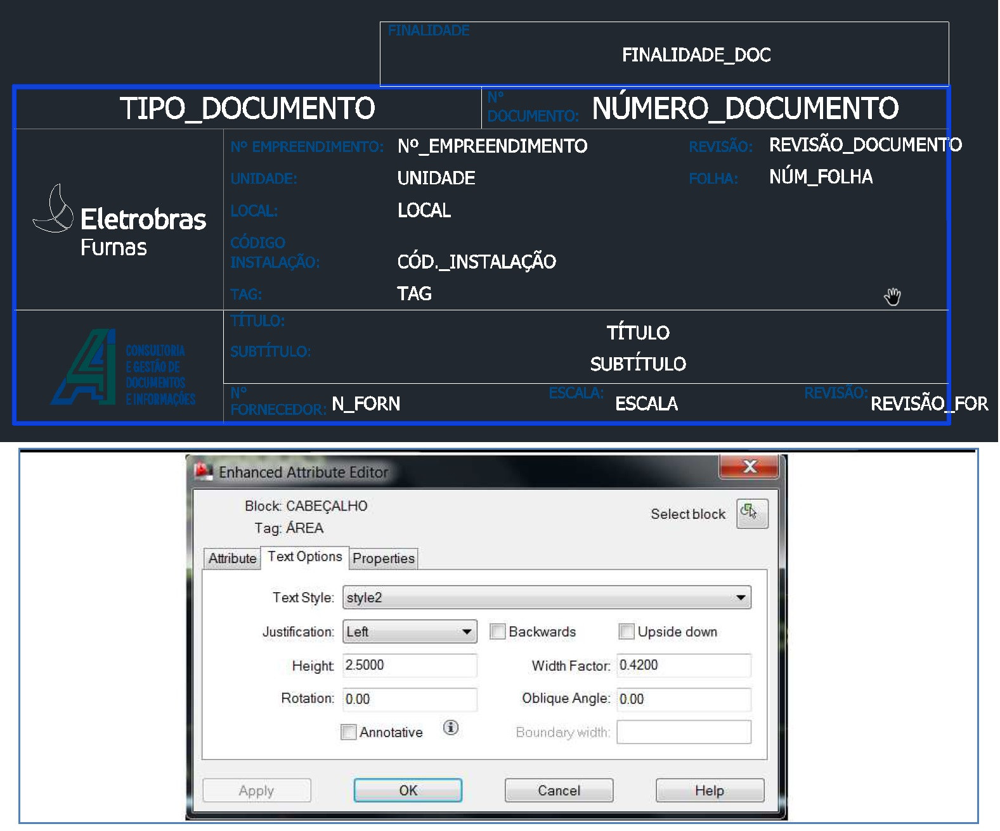

# ORIENTAÇÕES PARA ENTREGA DE DOCUMENTOS TECNICOS DE ENGENHARIA

## OBJETIVO

Este manual apresenta os requisitos necessários para a entrega de documentos técnicos de engenharia para Furnas e o sistema GreenDocs, pelo qual estes documentos devem ser tramitados, com o objetivo de:
- Proteção contra perda de confidencialidade, uso impróprio ou perda de integridade;
- Distribuição, acesso, recuperação e uso;
- Armazenamento e preservação, incluindo preservação da legibilidade;
- Controle de alterações ou mudanças;
- Retenção e disposição.

## TERMOS E DEFINIÇÕES

| Termo | Definição |
|:-----:|:------|
| Formato | Documento modelo para desenvolvimento dos documentos do projeto Word, Excel, Cad. |
| Projetista | Empresa contratada para desenvolver projeto de engenharia, fabricação, construção e/ou montagem. |
| GRD | Guia de Remessa de Documentos Técnicos. Arquivo Excel preenchido pelo projetista com informações referentes aos documentos de sua responsabilidade. Através deste arquivo que o GreenDocs permite o upload dos documentos |
| Greendocs | Software de gestão eletrônica de documentos utilizado por Furnas. |
| KOM | Kick Off Meeting – Reunião Inicial do Projeto |
| LD/Peder | Lista de Documentos. Arquivo Excel preenchido pelo fornecedor para reserva de numeração no GreenDocs. |

## DOCUMENTOS DE REFERÊNCIA

| Número do documento | Título |
|:-----:|:------|
| PEDER | LD / Peder |
| NOE-01 | Norma Identificação Operacional de Equipamentos do Sistema Eletroenergético |
| GRD | Guia de Remessa de Documentos Técnicos |
| | Formatos e Desenhos Padrões |
| | Procedimento para Execução de Desenho em AutoCad. |

## DOCUMENTOS DE PROJETO DE ENGENHARIA

Os documentos técnicos de projeto de engenharia são gerenciados pelo sistema GreenDocs. A entrada destes documentos no GreenDocs será feita através da GRD padrão do projeto, juntamente com os documentos já previstos na PEDER.

Entende-se por documentos técnicos de projeto de engenharia os documentos como, por exemplo, fluxogramas, especificações técnicas, folhas de dados, plantas, desenhos técnicos, memórias de cálculo, listas de materiais, memoriais descritivos e diagramas para uso em projetos. Estes documentos serão tramitados pelo GreenDocs.

Os documentos gerenciais, contábeis e financeiros como, por exemplo, contratos, cartas, relatórios de medição, cronogramas, EAP, listas de pendências, documentações legais, relatórios de diário de obra, boletins de acompanhamento, alvarás e licenças e notas fiscais não serão tramitados pelo GreenDocs.

### LISTA DE DOCUMENTOS

A PEDER é o primeiro documento a ser gerado pelo fornecedor e precisa ser enviada via sistema de GED para a solicitação das numerações dos documentos técnicos de projeto de engenharia.

Deverá ser preenchida conforme instruções deste Manual e para todos os documentos técnicos de projeto de engenharia que serão desenvolvidos pelo projetista.

O modelo de PEDER é um arquivo em excel cujo o modelo não pode ser alterado pelo projetista.

 <br>
[A numeração dos documentos é gerada pelo sistema a partir das informações preenchidas na PEDER.](../img/furnas_ld_peder.jpg)

[Com a numeração gerada, o projetista pode realizar o upload do documento através da GRD.](../img/furnas_grd.jpg) <br>


O projetista irá importar a PEDER via GreenDocs até 7 dias úteis após o KOM. Em caso de divergência na PEDER, a equipe do Arquivo Técnico de Furnas entrará em contato com o projetista.

A revisão da PEDER para inclusão de novos documentos poderá ser feita na primeira semana de cada mês.

### SISTEMÁTICA DA DOCUMENTAÇÃO TECNICA DE ENGENHARIA

Os documentos técnicos de projeto de engenharia devem ser gerados com base nos padrões de numeração, formatos e tamanhos indicados neste manual.

#### NUMERAÇÃO DE DOCUMENTOS

O Número do Documento é gerado pelo GreenDocs, com base nas informações da PEDER entregue pelo projetista, e segue a regra:

> **`UUU - AAAAAAAA - TT - DDD - SSSS`**
```
UUU - Unidade de Furnas
      AAAAAAAA - Identificação da área
                 TT - Tipo de documento
                      DDD - Disciplina
                            SSSS - Número Sequencial
```
`Exemplo: GER-UHMSO-DE-PEC-0001`
```
Esta numeração indica que este é o primeiro desenho
de automação e controle da Usina Hidrelétrica de
Manso da unidade de Geração.
```

- A Tabela 1 explica a composição da numeração do documento e destaca em qual local podemos encontrar cada item.
- A Tabela 2 indica as Unidades.
- A Tabela 3 é a lista de disciplinas, com a sigla e exemplos de documentos técnicos.
- A Tabela 4 é a lista de Tipos Documentais, com a sigla dos tipos de documentos que podem ser emitidos e exemplos.

**TABELA 1** – COMPOSIÇÃO DA NUMERAÇÃO - EXEMPLO

| ITEM | SIGNIFICADO | DESCRIÇÃO | REFERÊNCIA |
|:-----:|:-----:|:-----:|:------|
| GER | Unidade | Geração | Conforme TABELA 2 |
| UHMSO | Identificação da área | Usina Hidrelétrica de Manso | NOE-01 |
| PEC | Disciplina | Proteção e controle | Conforme TABELA 3 |
| DE | Tipo de documento | Desenho | Conforme TABELA 4 |
| 0001 | Sequencial | 0001 | Automático do sistema |

**TABELA 2** – UNIDADE DE FURNAS

| SIGLA | UNIDADE | DESCRIÇÃO |
|:-----:|:-----:|:------|
| GRL | Geral | Aplica-se a documentos que estão relacionados a todas as áreas de Furnas |
| GER | Geração de energia | Aplica-se a documentos destinados a área de geração de energia |
| TRA | Transmissão | Aplica-se a documentos destinados a área de transmissão de energia |
| MEI | Meio Ambiente | Aplica-se a documentos destinados a área de Meio Ambiente |
| SEG | Segurança de Barragem | Aplica-se a documentos destinados a área de Segurança de Barragem |

**TABELA 3** – DISCIPLINAS

| SIGLA | DISCIPLINA | EXEMPLOS |
|:-----:|:-----:|:------|
| PEC | Proteção, Automação e Controle | Diagrama de Arquitetura do Sistema de Comunicação , Diagramas Construtivos Diagramas de Fiação, Diagramas de Interligação, Diagramas Funcionais, Diagramas Lógico, Lista de cabos , Lista de Materiais, Lista de mensagens GOOSE, Lista de pontos de supervisão, Lista de Sobressalentes e ferramentas especiais, Manual, Memorial de Ajustes do Sistema de Proteção, Plano de Inspeção e Teste de cabos, Plano de Inspeção e Teste de painéis, Plano de Treinamento, Plano para teste de aceitação em campo, Plano para teste de aceitação em fábrica, Relatórios de testes, Tabelas de fiação, Tabelas de interligação, Telas IHM, Definição Final de Fornecimento (DFF). |
| CIV | Civil | Plano de Carga, Layout de Civil, Plano de Demolição, Planta de Fundação e Principais Formas, Planta de Drenagem, Padrões de Arquitetura, Planta Subterrânea. Desenhos, Plataformas, Listas e Memoriais de Estruturas Metálicas, Sondagens Geotécnicas, Estudo preliminar de arquitetura, Projeto Estrutural, Paisagismo, Sistema de Tratamento de Esgoto Sanitário, Sistema de Abastecimento e Tratamento de Água, Drenagem Oleosa, Levantamento Planialtimétrico (Topografia), Estruturas de Barramentos e Equipamentos, Locação de Bases, Canaletas e Edificações, Detalhes de Canaletas, Fundações, Urbanização, Estruturas de Concreto Armado, Projetos Arquitetônicos e Civis das Edificações, Estruturas Metálicas, Terraplenagem, Drenagem Pluvial. |
| ELE | Elétrica | Lista de Cargas Elétricas, Diagrama Básico de Linha Única e Distribuição de Cargas com base no Processo, Localização e Características da Infraestrutura Elétrica, Sistema Eletrônico de Potência, Conversores Elétricos e Inversores de Frequência Carregadores de Baterias e UPS, Aterramento. |
| EMC | Eletromecânica | Diagrama Unifiliar Simplificado (Geral, Setorial, Serv. Auxiliares); Arranjo Físico (Localização, Plantas e Cortes - Geral, Setorial); Iluminação e Tomadas - Listas, Memorial de cálculo, plantas, cortes e detalhes; Dutos e Canaletas - Listas, Memorial de cálculo, plantas, cortes e detalhes; Rede de Terra - Listas, Memorial de cálculo, plantas, cortes e detalhes; Equipamentos Elétricos - Detalhes de Instalação em Geral; Área Terciária - Planta, cortes, Listas e Memorial de Cálculo; SPDA (Sistema de Proteção de Descarga Atmosférica) - Listas, Memorial de cálculo, plantas, cortes e detalhes; Sistema de Proteção Contra Incêndio; Barramentos - Memória de cálculo, planta de flechas /tensões /esforços /esticamento, listas; Casa de Comando/Relés - Disposição de equipamentos, dutos, canaletas e eletrodutos, iluminação, rede de terra, listas; Casa do GMG - Disposição de equipamentos, dutos, canaletas e eletrodutos, iluminação, rede de terra, listas; Projeto do sistema solar fotovoltaico. |
| EQP | Equipamentos | Equipamentos de Carga e Descarga (Guindastes), de Pesagem e Dosagem (balanças), Geradores, motores elétricos, Separadores Mecânicos, Centrífugas, Secadores Centrífugos e Rotativos, Evaporadores Centrífugos, filtros, Equipamentos de Granulação, Equipamentos de Aglomeração, Motoredutor, Transformadores, Reatores, Lista de Bomba e Equipamento, Transformador de corrente, Transformador de Potencial, Transformador de Força, Disjuntor, Secionadores, Para-Raios, Reator, Módulo Híbrido Banco de Capacitor, Transformador de Potência. |
| COO | Coordenação | Critérios de projeto, manuais, data book, Plano de Pintura, Plano de Soldagem, Plano de Qualidade, Inspeção (de Recebimento, de Testes, de Operação e de Manutenção entre outros. |
| MEC | Mecânica | Folha de Dados da Bomba, Folha de Dados de Tanque, Modelo 3D, Normas e Código aplicados ao EPC, Desenho de Instalação, Isométrico, Lista de Materiais de Tubulação, Planta e Cortes de Tubulação, Lista de Interligações e Tie-Ins, Lista de Suportes, Relatório de Flexibilidade, entre outros. |
| TEL | Telecomunicações | Aterramento de telecomunicações, Bobina de Bloqueio, CFTV, Diagrama de interligação Disposição de equipamentos, Estudo de viabilidade, Lista de cabos, Lista de Materiais, Manual, Memória de cálculo – dimensionamento de enlace óptico, Memória de cálculo – dimensionamento do sistema de energia, Percurso de cabos coaxiais, Percurso de cabos ópticos, Plano de emendas, Plano de face, Plano de treinamento, Projeto Construtivo, Projeto Funcional, Protocolo de Inspeção e testes Campo, Protocolo de Inspeção e testes Fábrica, Rádio, Rede Corporativa, Rede Estruturada, Rede Operativa, Sistema de alimentação 48Vcc, Sistema de aterramento de telecomunicações, Tabela de Crimpagem, Telefonia, Teleproteção, WLAN, Workstatement – sistema de telecomunicações. |

**TABELA 4** – TIPOS DOCUMENTAIS

| SIGLA | TIPO DOCUMENTAL | DESCRIÇÃO DE UTILIZAÇÃO E EXEMPLOS |
|:-----:|:-----:|:------|
| 3D | Modelo 3D | Modelo 3D (tridimensional) de uma instalação de produção ou parte dela. |
| CE | Certificado | Certificados de inspeção, de conclusão de montagem, de aferição de instrumentos, de auditoria, entre outros. |
| DB | Data Book | Conjunto de documentos referentes a um equipamento ou instalação, que pode ser composto por: certificado, desenho, memorial descritivo, lista, relatório e outros. |
| DE | Desenho | Plantas, layout, croqui, diagrama, fluxograma, anteprojeto e símbolos. |
| ES | Estudo | Parecer envolvendo aspectos de engenharia emitidos para fins legais do tipo: processo formal de partilha, de perícia ou avaliação, perícia ambiental e assemelhada. Documento serve de subsídio para um parecer técnico. |
| ET | Especificação técnica | Critérios de projeto, especificação de materiais, sistemas e equipamentos, especificação de processo ou instalações.
| FD | Folha de dados | De equipamento, de sistemas, de material a granel (válvulas, conexões), de processo, de instrumento, de tubulação (lista de linhas). |
| LD | Lista de documentos | Sem comentários (autoexplicativo). |
| LI | Lista | Relação de equipamentos, de instrumentos, de materiais, de suportes, de cabos (não se aplica a lista de linhas, que utiliza o código FD). |
| LM | Lista de Material | Sem comentários (autoexplicativo). |
| MA | Manual | De operação, de manutenção, de equipamento, de instrumentação, da embarcação, da garantia da qualidade, e outros. |
| MC | Memória de Cálculo | Sem comentários (autoexplicativo). |
| MD | Memorial Descritivo | Documento que descreve um conjunto de atividades, procedimentos, serviços ou processos e outros. |
| IT |  Instrução | Documento que descreve procedimento de obra referente a Construção e Montagem, Serviços, QSMS e outros. |
| PT | Parecer Técnico | Parecer para aquisição de sistemas, equipamentos e materiais. |
| RL | Relatório | De resultados, de estudo técnico, de levantamento de campo, proposta técnica.

#### RESERVA DA NUMERAÇÃO DO DOCUMENTO

Para a reserva da numeração do documento o projetista deve importar a LD/PEDER preenchida no GreenDocs, com a quantidade dos documentos por disciplina, considerando a unidade, área, tipo de documento e a disciplina. O sistema irá gerar a numeração dos documentos automaticamente.

Novas solicitações de numerações poderão ser feitas a cada 30 dias conforme data indicada no KOM de documentação.

Ao final do projeto o projetista deverá emitir a LD informando a última revisão e finalidade de todos os documentos emitidos. Esta informação é necessária para a checagem final do sistema.

Os números reservados e não utilizados devem ser cancelados dentro do GreenDocs através do botão “Cancelar Reserva”, esta ação pode ser realizada em lote ou individual conforme ilustrado na FIGURA 1.

**FIGURA 1** – CANCELAR RESERVA DE NUMERAÇÃO <br>


#### NOMEAÇÃO E EXTENSÃO DE ARQUIVOS ELETRÔNICOS

Os arquivos eletrônicos devem estar nomeados conforme o padrão: Numeração do Documento underline revisão do documento ponto extensão do arquivo eletrônico. 

`Exemplo: GER-UHMSO-DE-PEC-0001_0`

O GreenDocs não aceitará o carregamento do arquivo caso não esteja nomeado corretamente. Preferencialmente os arquivos eletrônicos deverão estar no formato nativo: DWG, DOC, XLS.

O **ANEXO I** - PADRÃO DE ENTREGA DOS ARQUIVOS ELETRÔNICOS apresenta uma relação com os tipos de documentos X títulos prováveis X formato em que devem ser entregues.

Não será permitido envio de arquivo compactado (zip, rar), exceto de documentos tipo book, caderno ou diagramas com muitas folhas. Para os demais documentos multi-folhas, todas devem ser salvas em um único arquivo DWG.

> **ATENÇÃO**: Para os documentos tipo book ou caderno poderá ser aceito 1 arquivo PDF do conjunto + arquivo compactado. O arquivo compactado poderá ser dos arquivos originais em documento multi-folhas ou dos arquivos separados e deve seguir o padrão de nomeação acima. Já a nomeação dos arquivos separados deverá seguir o mesmo padrão incluindo a folha do desenho, sendo: Número do documento underline revisão do documento folha sequencial ponto extensão do arquivo eletrônico.

> `Exemplo: GER-UHMSO-DE-PEC-0001_0_FL1.DWG.`

#### REQUISITOS DE FORMATAÇÃO

Todos os documentos técnicos de engenharia deverão atender aos requisitos de padrão, preenchimento e apresentação, os Formatos e Desenhos Padrões e as orientações da Norma Identificação Operacional de Equipamentos do Sistema Eletroenergético. Não serão aceitos documentos fora deste padrão. Em caso de dúvidas, consultar pelo e-mail arqtec@furnas.com.br

A emissão de novos documentos deve ser realizada sempre em formato eletrônico e em programas compatíveis, conforme abaixo:

- Pacote Microsoft Office (Word, Excel);
- AutoCad;
- Outros softwares: consultar pelo e-mail arqtec@furnas.com.br

Para documentos elaborados em AutoCad devem ser verificados os critérios para execução no documento de referência Procedimento para Execução de Desenho em AutoCad.

O projetista é responsável por garantir o correto preenchimento dos documentos, e deverá seguir as instruções de preenchimento sinalizadas na FIGURA 2 e as informações preenchidas conforme indicado na TABELA 5 abaixo.

**FIGURA 2** – LEGENDA PARA DOCUMENTOS - EXEMPLO WORD <br>


**TABELA 5** – INFORMAÇÕES QUE DEVEM SER PREENCHIDAS NA LEGENDA

| CAMPO | PREENCHIMENTO |
|:------|:------|
| 1 - Tipo Documental | Preencher conforme tipo documental da TABELA 4. |
| 2 - Nº Documento | Número fornecido pelo GreenDocs, com base nas informações inseridas pelo projetista. |
| 3 - Nº Empreendimento | Número do PEP do empreendimento |
| 4 - Revisão | Número da revisão |
| 5 - Folha | Páginas do documento. Atualizar manualmente a quantidade total de páginas. |
| 6 - Unidade | Preencher conforme TABELA 2. |
| 7 - Local | Preencher conforme Norma NOE-01 |
| 8 - Cod.de instalação | Código de origem do SAP |
| 9 - TAG | Preencher com informações de identificação dos equipamentos, instrumentos, linhas e voltagem |
| 10 - Título | Preencher conforme sugestão do ANEXO II – LISTA DE SUGESTÃO DE TÍTULOS POR DISCIPLINA. |
| 11 - Subtítulo | Preencher com informações complementares ao campo 10 - TÍTULO. |
| 12 - Logo | Inserir a logo do projetista responsável pela elaboração do documento/ desenho. |
| 13 - Nº Fornecedor | Número do documento no projetista, se não especificado preencher com N/A. |
| 14 - Revisão | Número da revisão do número do projetista. Esse campo deve ser preenchido somente se o campo 10 estiver preenchido, caso contrário preencher com “–”. |
| 15 - Descrição da revisão | Número da revisão conforme o campo 4 - REVISÃO, mantendo histórico das revisões do documento, e a explicação detalhada do que foi alterado na revisão especificada |
| 16 - Tabela de Finalidade | Sinalizar com um X qual a finalidade do documento |
| 17 - Controle de revisão | |

Informações importantes e complementares:

- No campo 11 - SUBTÍTULO: Evitar repetições de informações já presentes no TÍTULO.
- No campo 15 - DESCRIÇÃO E/OU FOLHAS ATINGIDAS: A REV. 0 estará descrita sempre como “EMISSÃO INICIAL”. **Não utilizar** o termo “**Revisão Geral**”. Manter o histórico das revisões.
- Para preenchimento da área, em todos os formatos de templates, é possível reduzir a fonte caso o espaço não seja suficiente. Para Word e Excel é permitido reduzir a fonte até tamanho 8, e nos templates de Autocad deve ser reduzido até 0.42. Todo o preenchimento da legenda deve ser feito em letra MAIÚSCULA.

A FIGURA 3 demonstra o preenchimento correto com a fonte reduzida para a área e a instrução do campo onde deve ser alterado o tamanho da fonte no Autocad.

**FIGURA 3** – EXEMPLO DE LEGENDA – FONTE <br>


#### REVISÃO DE DOCUMENTOS

A revisão identifica a sequência da emissão. Os documentos deverão ser emitidos inicialmente na revisão 0 e posteriormente atendendo sequência alfanumérica e numérica: 0A, 0B, 0, 1A, 1B, 1 e etc.

No QUADRO DE CONTROLE DE REVISÃO deve ser indicada a revisão, a data da presente revisão, o nome do projeto T e as siglas dos responsáveis pela elaboração, verificação e aprovação da atual revisão.

A revisão 0, e suas devidas informações, deve ser mantida fixa para as demais revisões, conforme FIGURA 4. Caso o documento alcance a REV. 9, a mesma deve ser preenchida no lugar da REV. 1 e as informações da REV. 0 devem ser mantidas.

A descrição de todas as revisões deve ser preenchida no ÍNDICE DE REVISÕES (campo 13 da TABELA 4), quando o mesmo existir no formato do documento.

**FIGURA 4** – QUADRO DE CONTROLE DE REVISÃO <br>


#### FINALIDADE DE EMISSÃO

A finalidade do documento deve refletir a ação que se espera do documento e deve ser assinalada com um X no carimbo conforme ilustrado na FIGURA 5.

**FIGURA 5** – CARIMBO DE FINALIDADE <br>


No caso de cancelamento de documentos, o projetista deverá emitir uma nova revisão do documento, assinalando no carimbo a finalidade de emissão “CANCELADO” e informando se houve ou não substituição por outro documento.

O cancelamento precisa ser indicado também no campo específico de finalidade na GRD.

## DOCUMENTO EXISTENTE

Serão considerados como existentes os documentos técnicos de engenharia que já existem no acervo de Furnas e que terão seu conteúdo revisado para atualizações conforme necessidade do projeto. Estes documentos devem ser atualizados através de revisão pelo projetista responsável e terão 2 números no sistema: o número do sistema legado existente e o Número do Documento (novo).

Os documentos existentes estarão disponíveis para consulta do fornecedor no sistema greendocs. Caso estes documentos estejam em sistemas legados deverão ser revisados emitidos no sistema greendocs.

### REVISÃO DE DOCUMENTOS EXISTENTES

Na necessidade de revisar documento existente, o fornecedor deverá solicitar a mesma via PEDER/LD. O template do
documento dever ser ajustado ao novo padrão de furnas.

## GREENDOCS

O GreenDocs é o sistema para gerenciamento eletrônico de documentos utilizado na tramitação de documentos técnicos de engenharia de Furnas.

O Projetista deve emitir os documentos no GreenDocs, por meio da GRD padrão. As informações preenchidas devem ser feitas com cuidado evitando abreviações, sob o risco de recusa de cadastro pelo sistema.

O sistema está disponível 24h porém, serão considerados entregues os documentos que forem colocados no GreenDocs em dias úteis das 9h às 17h. Para prazos de fluxos serão consideradas apenas as horas úteis.

O projetista tem permissão de importar somente os documentos previstos e com o Número do Documento identificado na PEDER/LD. É responsabilidade do projetista fazer a previsão correta e antecipada de documentos na LD.

O acesso ao sistema deve ser feito pelo endereço [https://flow.furnas.com.br](https://flow.furnas.com.br). Deve ser colocado o e-mail cadastrado e no primeiro acesso à senha é GreenDocs. No primeiro acesso o sistema solicitará a troca da senha.

Para algumas funcionalidades, como importação em lote, sugerimos o uso do navegador Chrome.

**FIGURA 6** – LOGIN NO GREENDOCS <br>


### IMPORTAÇÃO DA LD

Para importar a LD no GreenDocs, deve-se seguir os passos indicados abaixo:

1. Clicar no campo “ADICIONAR” na coluna da esquerda e escolher “Lista de Documentos”. <br>
    Sequencia: ADICIONAR – Lista de Documentos

    **FIGURA 7** – ADICIONAR LD <br>
    

2. Identificar o fornecedor da LD e clicar em “Concluir”. <br>
    Sequencia: Fornecedor - Concluir
    
    

3. Fazer upload do arquivo da LD e emitir. <br>
    Sequencia: Upload – Adicionar arquivo(s) – Concluir – Emitir.

    **FIGURA 8** – UPLOAD DA LD <br>
    

Após concluir e emitir a LD via sistema, é gerada automaticamente a numeração do documento.

A devolução da LD será feita pelo sistema através de uma notificação no e-mail cadastrado. O fornecedor deve exportar via GreenDocs a LD atualizada para verificar os números que deverá utilizar em cada documento.

Para incluir nova revisão da lista, entrar no cadastro da mesma, e utilizar o botão solicitar sequenciais, conforme FIGURA 9 abaixo:
