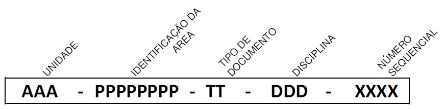

FURNAS - GERAÇÃO E TRANSMISSÃO - Regra de numeração Furnas

# SISTEMA DE NUMERAÇÃO DE DOCUMENTOS

=== "UNIDADE (AAA)"
    GRL - Geral 
    GER - Geração 
    TRA - Transmissão 
    MEI - Meio Ambiente 
    SEG - Segurança de Barragem
=== "IDENTIFICAÇÃO DA AREA"
    Código da instalação no SAP
=== "TIPO DE DOCUMENTO (TT)"
    DB - Data Book 
    3D - Modelo 3D 
    CE - Certificado 
    DE - Desenho 
    ES - Estudo 
    ET - Especificação técnica 
    FD - Folha de dados 
    LD - Lista de documentos 
    LI - Lista 
    LM - Lista de Material 
    MA - Manual 
    MC - Memória de Cálculo 
    MD - Memorial Descritivo 
    PR - Procedimento 
    PT - Parecer Técnico 
    RL - Relatório 
=== "DISCIPLINA (DDDD)"
    CIV - Civil 
    COO- Coordenação 
    ELE - Elétrica 
    EMC - Eletromecânica 
    EQP - Equipamentos 
    GEO - Geotecnia 
    HID - Hidrologia 
    MEC - Mecânica 
    OPM- Operação e manutenção 
    PEC - Proteção e controle 
    TEL - Telecomunicações