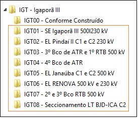

ELETROBRAS - GERAÇÃO E TRANSMISSÃO - Taxonomia para documentos de engenharia - Revisão 00A

# TAXONOMIA

## **AABBB.CC-DDD-EE-FFF.GG-HH-IIII-JJJ**

**AA** – Tipo da instalação<br>
**BBB** – Nome da instalação<br>
**CC** – Número do empreendimento<br>
**DDD** - Identificação do setor da Instalação por tipo de instalação<br>
**EE** – Finalidade do Projeto<br>
**FFF** - Identificação da Disciplina<br>
**GG** - Tipologia do documento<br>
**HHHH** - Número sequencial<br>
**III** - Identificação da revisão (automatizado pelo GED)


``EX1: SEIGT.01-SE2-PE-ELM-DE-0001-00A``<br>
``EX2: UHCNY.03-CSF-PB-CIV-DE-0007-01A``<br>
``EX3: UHCNY.03-UNG-FA-MEC-LM-0001-002``


```
_
|____Subestação de transmissão (AA – Tipo da instalação)
    |
    |____SE Igaporã III (BBB – Nome da instalação)
        |
        |____Etapa 01 (CC – Número do empreendimento)
        |   |
        |   |____Pátio 230 kV (DDD - Setor da Instalação)
        |       |
        |       |____Projeto Executivo (EE – Finalidade do Projeto)
        |           |
        |           |____Modelo civil (FFF - Identificação da Disciplina)
        |           |   |
        |           |   |____Documento SEIGT.01-SE2-PE-CIV-DE-0001-01B
        |           |   |
        |           |   |____Documento SEIGT.01-SE2-PE-CIV-DE-0002-000
        |           |   |
        |           |   |____Documento SEIGT.01-SE2-PE-CIV-MC-0003-00C
        |           |
        |           |
        |           |____Modelo eletromecânico
        |               |
        |               |____Documento SEIGT.01-SE2-PE-ELM-DE-0001-000
        |               |
        |               |____Documento SEIGT.01-SE2-PE-ELM-LM-0002-00B
        |               |
        |               |____Documento SEIGT.01-SE2-PE-ELM-MC-0003-00A
        |
        |
        |
        |____Etapa 02
            |
            |____Pátio 138 kV
                |
                |____Projeto Básico
                    |
                    |____Modelo civil
                    |   |
                    |   |____Documento SEIGT.02-SE1-PB-CIV-DE-0001-00B
                    |   |
                    |   |____Documento SEIGT.02-SE1-PB-CIV-DE-0002-000
                    |
                    |
                    |____Modelo eletromecânico
                        |
                        |____Documento SEIGT.02-SE1-PB-ELM-DE-0001-000
                        |
                        |____Documento SEIGT.02-SE1-PB-ELM-LM-0002-00A
```

O campo de revisão e extensão não precisam ser apontadas na taxonomia.

Instalações/ Unidade seriam tabeladas por letras com a denominação (usina, subestação, etc.) (uma sugestão seria utilizar os dígitos do ONS)

Existe a necessidade de desenvolver a taxonomia compatível com projetos simultâneos?

Ou as etapas concomitantes poderiam permanecer apenas como metadata e informação no carimbo?

AABBB, onde AA representa o tipo da instalação (UH Usina Hid., ST sub. trans., LT Lin. trans.) e BBB representa a nome da instalação (TUC Tucuruí, FUR Furnas, etc.)

### **Tabela 1**: AA – Tipo da instalação

**Tipo da instalação**: hidro, termo, eólica, solar, nuclear; subestação, linha, estação repetidora; PCH, subestação, LD, etc

| Campo AA | Descrição                 |
| :------: | :------------------------ |
|    GR    | Geral                     |
|    UH    | Usina hidroelétrica       |
|    SE    | Subestação de transmissão |
|    LT    | Linha de transmissão      |
|    UT    | Usina termoelétrica       |
|    EO    | Planta eólica             |
|    PS    | Planta solar              |
|    NU    | Usina nuclear             |
|    HI    | Hidrogênio                |
|   ...    | ...                       |

### **Tabela 2**: BBB – Nome da instalação

| Campo BBB | Descrição        |
| :-------: | :--------------- |
|    ELB    | Geral Eletrobras |
|    TUC    | Tucuruí          |
|    CNU    | Coaracy Nunes    |
|    FUR    | Furnas           |
|    IGT    | Igaporã III      |
|    ...    | ...              |

### **Tabela 3**: CC – Número do empreendimento

| Campo CC | Descrição       |
| :------: | :-------------- |
|    00    | Como construído |
| 01 a 99  | Demais etapas   |



.CC é o campo para o número do empreendimento; neste, o número 00 é reservado para o conforme construído, definido na tabela de Finalidade do Projeto com o código 'CC', e o número 99 para padrões de engenharia.

``EX: SEIGT.00-SE2-CC-ELM-DE-0001-004``

### **Tabela 4**: DDD - Identificação do setor da Instalação por tipo de instalação

| Tipo da instalação | Campo DDD | Descrição                     |
| :----------------: | :-------: | :---------------------------- |
|         GR         |    GRL    | Geral                         |
|         UH         |    USN    | Usina                         |
|         UH         |    CSF    | Casa de Força                 |
|         UH         |    EDC    | Edifício de Comando           |
|         UH         |    TMA    | Tomada d'Água                 |
|         UH         |    TBS    | Tubo de Sucção                |
|         UH         |    CNA    | Canal de Adução               |
|         UH         |    CNF    | Canal de Fuga                 |
|         UH         |    VRT    | Vertedouro                    |
|         UH         |    BGP    | Barragem Principal            |
|         UH         |    RSV    | Reservatório                  |
|         UH         |    SEU    | Subestação da Usina           |
|         UH         |    NCL    | Nacele                        |
|         UH         |    TOR    | Torre                         |
|         UH         |    HUB    | Hub                           |
|         UH         |    AEG    | Aerogerador                   |
|         UH         |    FND    | Fundação                      |
|         UH         |    APT    | Acesso/Plataforma             |
|         UH         |    LTU    | Linha de Transmissão da Usina |
|         UH         |    UNG    | Unidade Geradora              |
|         UH         |    MDF    | Módulo Fotovoltaico           |
|         UH         |    ETC    | Eletrocentro                  |
|         SE         |    SE0    | Pátio de 69 kV                |
|         SE         |    SE1    | Pátio de 138 kV               |
|         SE         |    SE2    | Pátio de 230 kV               |
|         SE         |    SE5    | Pátio de 500 kV               |
|         SE         |    CSR    | Casa de relés                 |
|         SE         |    CSC    | Casa de comando               |
|         LT         |    RAM    | Ramal de LT                   |

### **Tabela 5**: EE – Finalidade do Projeto

| Campo EE | Descrição                       |
| :------: | :------------------------------ |
|    AP    | Anteprojeto/ Estudo para leilão |
|    PB    | Projeto básico                  |
|    FA    | Projeto de fabricação           |
|    PE    | Projeto executivo               |
|    CC    | Como construído                 |

### **Tabela 6**: FFF - Identificação da Disciplina

**Disciplina geral**: arquitetura (main), civil, eletromecânica, equipamento, rede de dados, telecomunicações, proteção (controle e automação), elétrica, mecânica, meio-ambiente, fundiário, coordenação, gestão, inspeção, etc.

| Campo FFF | Descrição                           |
| :-------: | :---------------------------------- |
|    ARQ    | Arquitetura, Urbanismo e Paisagismo |
|    CIV    | Civil                               |
|    ELM    | Eletromecânica                      |
|    PCS    | Proteção, Controle e Supervisão     |
|    SAX    | Serviços Auxiliares                 |
|    ELE    | Elétrica                            |
|    EQP    | Equipamentos de Levantamento        |
|    GRL    | Geral*                              |
|    MEC    | Mecânica                            |
|    OEM    | O&M da Usina                        |
|    PLN    | Planejamento                        |
|    QUA    | Qualidade                           |
|    TEC    | Documentação Técnica                |
|    ...    | ...                                 |

> __*__ Em Caso de Disciplina ‘Geral’ localizar o sistema mais próximo na tabela 8.

### **Tabela 7**: GG - Tipologia do documento

**Tipo do documento**: desenho, arranjo, vista, corte, pradrão, modelo, uniformização, nota técnica, relatório, certificado, ata, R3, R4, etc.

| Campo GG | Descrição                                              |
| :------: | :----------------------------------------------------- |
|    AA    | Arquitetura / Topologia de Redes                       |
|    AC    | Ação Corretiva e Preventiva                            |
|    AQ    | Atestado de Qualidade                                  |
|    BI    | Boletim de Inspeção                                    |
|    CA    | Certificado de Materiais                               |
|    CC    | Certificado de Conclusão de Comissionamento            |
|    CM    | Certificado de Conclusão de Montagem                   |
|    CP    | Critério de Projeto                                    |
|    CQ    | Croquis                                                |
|    CR    | Cronograma                                             |
|    CT    | Catálogo                                               |
|    DB    | Data Book                                              |
|    DD    | Diagrama Dimensional                                   |
|    DE    | Desenhos Civil, Elétrico e Mecânico                    |
|    DF    | Diagrama Funcional                                     |
|    DI    | Diagrama de Interligação de Equipamentos e Painéis     |
|    DL    | Diagrama Lógico                                        |
|    DM    | Detalhes de Montagem de Equipamentos                   |
|    DO    | Diário de Obra                                         |
|    DT    | Detalhes Típicos/Padrões                               |
|    DU    | Diagramas Unifilares e Esquemáticos                    |
|    ET    | Especificação Técnica                                  |
|    FD    | Folha de Dados do Equipamento                          |
|    FI    | Diagrama de Fiação                                     |
|    FL    | Fluxograma                                             |
|    FR    | Formulário                                             |
|    FT    | Diagrama Funcional Integrado                           |
|    IE    | Instruções Executivas                                  |
|    IT    | Instruções de Trabalho                                 |
|    LA    | Lista de Aprovisionamento de Materiais                 |
|    LC    | Lista de Cabos                                         |
|    LD    | Lista de Documentos                                    |
|    LE    | Lista de Estimativas de Materiais                      |
|    LF    | Lista de Ferro                                         |
|    LI    | Lista de Instrumentos                                  |
|    LM    | Lista de Materiais                                     |
|    LP    | Lista de Pontos / Sinais                               |
|    LQ    | Lista de Equipamentos                                  |
|    MC    | Memória de Cálculo                                     |
|    MD    | Memorial Descritivo                                    |
|    MM    | Manual de Montagem                                     |
|    MN    | Manual de Comissionamento                              |
|    MO    | Manual de Operação e Manutenção                        |
|    MP    | Modificação de Projeto no Campo                        |
|    MQ    | Manual de Qualidade                                    |
|    NC    | Não Conformidades                                      |
|    OC    | Orçamento                                              |
|    OR    | Organograma                                            |
|    PC    | Plano de Comissionamento                               |
|    PE    | Programa de Ensaios                                    |
|    PI    | Plano de Inspeção e Controle da Qualidade (PICQ)       |
|    PL    | Programa de Treinamento                                |
|    PN    | Procedimento de Inspeção                               |
|    PQ    | Plano ou Procedimento de Qualidade                     |
|    PT    | Procedimento de Teste                                  |
|    RA    | Relatório de Análise de Documentos Recebidos           |
|    RD    | Relatório de Documentos                                |
|    RE    | Relatório de Alteração de Especificação Técnica (RAET) |
|    RF    | Relatório de Inspeção em Fábrica                       |
|    RI    | Relatório de Inspeção em Campo                         |
|    RN    | Ata de Reunião                                         |
|    RP    | Relatório de Progresso                                 |
|    RQ    | Relatório de Qualidade                                 |
|    RT    | Relatório Técnico                                      |
|    RV    | Relatório de Viagem                                    |
|    SB    | Lista de Sobressalentes                                |
|    SX    | Sumário Executivo                                      |
|    TA    | Teste de Aceitação                                     |
|    TI    | Tabela de Interligação Externa                         |
|    PB    | Projeto Básico                                         |

### **Campo**: HHHH - Número sequencial de 0001 a 9999.

### **Tabela 8**: III - Identificação da revisão

|                        Campo III                        | Descrição                                      |
| :-----------------------------------------------------: | :--------------------------------------------- |
|                        000 a 099                        | Revisão numérica - Documentos aprovados        |
| 00A, 00B, 00C, ...<br> 01A, 01B, ... <br> 02A, 03A, ... | Revisão alfanumérica - Documentos em aprovação |

Justificativa de revisão regressiva no lugar de progressiva e para manter os campo completos na primeira revisão, evitando uma lógica extra apenas para eliminar caracteres.

Revisão progressiva - Não<br>
A - B - 000 - 00A - 00B - 001 - 01A - 01B - 002

Revisão regressiva - Sim<br>
00A - 00B - 000 - 01A - 01B - 001 - 02A - 02B - 002

____________________________________________________________________________

Outros:

Unificar os status: aprovado, aprovado com cometários, reprovado, aprovado para fabricação, etc.
Separar fluxos de G&T.

- Projetos básicos
- Projetos executivos
- R4
- Especificações e memórias
- Inspeção
- Relatórios EPE

____________________________________________________________________________

### **Tabela ?**: ?? - Identificação da Subdisciplina por Disciplina

**Subdisciplina**: Edificação, fundação, galeria de cabos, barramento aéreo, instalação, barramento de processos, barramento de estação, arquitetura de rede, SDH, SAX, ar condicionado, TAF (CFI), etc.

|  FFF  | Campo ?? | Descrição                                               |
| :---: | :------: | :------------------------------------------------------ |
|  ARQ  |    AC    | Acabamentos de Arquitetura                              |
|  ARQ  |    AR    | Arranjos Gerais/Layout                                  |
|  ARQ  |    UR    | Urbanismo/Paisagismo                                    |
|  CIV  |    AR    | Arranjos Gerais/Layout                                  |
|  CIV  |    DE    | Sistemas de drenagem                                    |
|  CIV  |    EA    | Armação                                                 |
|  CIV  |    EF    | Estruturas de concreto - Formas                         |
|  CIV  |    EM    | Estruturas metálicas                                    |
|  CIV  |    GG    | Geologia/Geotécnica                                     |
|  CIV  |    HH    | Hidrologia/Hidráulica                                   |
|  CIV  |    IN    | Instrumentação Civil                                    |
|  CIV  |    PV    | Pavimentação e Terraplanagem                            |
|  CIV  |    RS    | Redes de Serviços                                       |
|  CIV  |    TR    | Tratamento de Fundações e Taludes                       |
|  ELE  |    AT    | Aterramento                                             |
|  ELE  |    BB    | Barramento Blindado de fases isoladas                   |
|  ELE  |    BC    | Baterias e Carregadores                                 |
|  ELE  |    BT    | Painel de Serviços Auxiliares de Baixa Tensão (CA/CC)   |
|  ELE  |    CB    | Cablagem                                                |
|  ELE  |    CE    | Condutos para Cabos                                     |
|  ELE  |    CG    | Cubículos Associados ao Gerador                         |
|  ELE  |    CM    | Cubículos de Serviços Auxiliares de Média Tensão        |
|  ELE  |    CP    | Sistema de Proteção                                     |
|  ELE  |    CS    | Sistema de Comando, Controle e Supervisão               |
|  ELE  |    EE    | Estudos Elétricos                                       |
|  ELE  |    ES    | Equipamentos de Pátio da Subestação                     |
|  ELE  |    EX    | Sistema de Excitação                                    |
|  ELE  |    GD    | Grupo Diesel de Emergência                              |
|  ELE  |    GE    | Gerador                                                 |
|  ELE  |    GI    | Barramento Blindado SF6                                 |
|  ELE  |    IE    | Instalação Elétrica                                     |
|  ELE  |    IT    | Iluminação e Tomadas                                    |
|  ELE  |    LT    | Linha de Transmissão                                    |
|  ELE  |    MT    | Cubículo de Média Tensão                                |
|  ELE  |    PE    | Painel de Parada de Emergência                          |
|  ELE  |    PH    | Controle Pitch (Eólica)                                 |
|  ELE  |    RD    | Registrador Digital de Perturbação (Oscilografia)       |
|  ELE  |    RL    | Reator Limitador de Corrente                            |
|  ELE  |    RT    | Regulador de Tensão                                     |
|  ELE  |    RV    | Regulador de Velocidade                                 |
|  ELE  |    SA    | Sistema Auxiliares Elétricos                            |
|  ELE  |    SE    | Sistema de Medição de Energia                           |
|  ELE  |    SL    | Equipamentos de Saída de Linha                          |
|  ELE  |    SM    | Sistemas Auxiliares Mecânicos                           |
|  ELE  |    TE    | Transformador Elevador                                  |
|  ELE  |    TI    | Transformador de Iluminação                             |
|  ELE  |    TL    | Sistema de Telecomunicação                              |
|  ELE  |    TR    | Transformador de Regulação                              |
|  ELE  |    TS    | Transformador de Serviços Auxiliares                    |
|  ELE  |    VE    | Sistema de Vigilância Eletrônica                        |
|  ELE  |    YW    | Controle Yaw (Eólica)                                   |
|  ELE  |    ST    | String Box                                              |
|  ELE  |    IV    | Inversor de frequência                                  |
|  EQP  |    MG    | Máquina Limpa Grades                                    |
|  EQP  |    PA    | Ponte Rolante Auxiliar                                  |
|  EQP  |    PJ    | Pórtico Rolante de Jusante do Vertedouro                |
|  EQP  |    PM    | Pórtico Rolante de Montante do Vertedouro               |
|  EQP  |    PO    | Ponte Rolante da Oficina Eletromecânica                 |
|  EQP  |    PP    | Ponte Rolante Principal                                 |
|  EQP  |    PS    | Pórtico Rolante do Tubo de Sucção                       |
|  EQP  |    PT    | Pórtico Rolante da Tomada d'água                        |
|  EQP  |    TM    | Talha Manual                                            |
|  MEC  |    AC    | Sistema de Ar Comprimido                                |
|  MEC  |    AF    | Arranjo Físico/Layout                                   |
|  MEC  |    AI    | Sistema de Combate a Incêndio                           |
|  MEC  |    AM    | Acabamentos Metálicos                                   |
|  MEC  |    AN    | Sistema de Água Nebulizada dos Transformadores          |
|  MEC  |    AP    | Sistema de Água Potável                                 |
|  MEC  |    AR    | Sistema de Água de Resfriamento                         |
|  MEC  |    AS    | Sistema de Água de Serviço                              |
|  MEC  |    CH    | Centrais Hidráulicas                                    |
|  MEC  |    CO    | Sistema de CO2                                          |
|  MEC  |    CP    | Comportas                                               |
|  MEC  |    DR    | Sistema de Drenagem                                     |
|  MEC  |    EE    | Sistema de Tratamento de Esgoto                         |
|  MEC  |    EL    | Elevador                                                |
|  MEC  |    ES    | Sistema de Esgotamento e Enchimento das Unidades        |
|  MEC  |    GB    | Gear Box (Eólica)                                       |
|  MEC  |    IN    | Instrumentação                                          |
|  MEC  |    MA    | Mancais                                                 |
|  MEC  |    MH    | Sistema de Medições Hidráulicas                         |
|  MEC  |    MO    | Sistema de Monitoramento                                |
|  MEC  |    OM    | Oficina Mecânica                                        |
|  MEC  |    PA    | Pás (Eólica)                                            |
|  MEC  |    PH    | Controle Pitch (Eólica)                                 |
|  MEC  |    RV    | Regulador de Velocidade da Turbina                      |
|  MEC  |    SI    | Sistema de Coleta e Separação de Água/Óleo Isolante     |
|  MEC  |    SL    | Sistema de Tratamento de Óleo Lubrificante              |
|  MEC  |    SR    | Sistema de Rebaixamento de Nível                        |
|  MEC  |    TB    | Tubulação Embutida                                      |
|  MEC  |    TU    | Turbina                                                 |
|  MEC  |    TX    | Tubulação Exposta                                       |
|  MEC  |    VC    | Sistema de Ar Condicionado                              |
|  MEC  |    VE    | Sistema de Ventilação                                   |
|  MEC  |    VS    | Vazão Sanitária                                         |
|  MEC  |    SH    | Sistema Hidráulico de Limpezas dos Módulos Fotovoltaico |
|  OEM  |    GO    | Geral Operação da Usina                                 |
|  PLN  |    AE    | Acompanhamento Executivo                                |
|  PLN  |    CO    | Comissionamento                                         |
|  PLN  |    FE    | Fornecimento Eletromecânico                             |
|  PLN  |    FI    | Financeiro                                              |
|  PLN  |    ME    | Montagem Eletromecânica                                 |
|  PLN  |    OC    | Obra Civil                                              |
|  PLN  |    PJ    | Projeto                                                 |
|  PLN  |    PR    | Programação                                             |
|  QUA  |    QA    | Auditoria de Sistema de Gestão de Qualidade             |
|  QUA  |    PL    | Plano                                                   |
|  QUA  |    PR    | Procedimento                                            |
|  QUA  |    TR    | Treinamento                                             |
|  QUA  |    CI    | Convocação de Inspeção                                  |
|  TEC  |    RG    | Relatório de Gestão de Documentos                       |
|  GRL  |    GG    | Geral                                                   |